# 宠舍管家页面与业务流程逆向图

> 目标项目：**熊舍管家**  
> 逆向对象：宠舍管家（Cattery Manager）`2.15.0 (73)`  
> 本文用途：把已发现的页面、导航、Controller / Binding 与业务入口整理成可直接支撑熊舍管家信息架构、PRD 和原型设计的页面基线。  
> 核验日期：2026-07-15

## 0. 本轮结论

1. **已验证（静态）：**应用采用 Flutter + GetX，存在 `app_pages.dart`、`tab_configuration.dart`、`adaptive_nav.dart`、`main_page.dart` 与 `pad_shell.dart`，整体是“自适应主壳 + 模块化页面 + 对话框/底部面板”的导航结构。
2. **已验证（静态）：**AOT 中可提取到 `205` 条 `presentation/pages` 源码路径，其中包括 `95` 个 `*_page.dart` 页面文件、`41` 个页面级 Binding、`39` 个页面目录内 Controller、`28` 个页面目录内对话框/组件，以及 `2` 个其他文件。
3. **已验证（静态）：**除页面目录内 Controller 外，`presentation/controllers` 还存在 `32` 个跨页面 Controller；合并页面和组件目录后，共可定位 `72` 条业务 Controller 源码路径、`43` 条业务 Binding 源码路径（含 `InitialBinding`、`GroomingListBinding` 两条应用级 Binding）。
4. **已验证（App Store 展示）：**当前版本公开截图明确展示“孕期管理、宠舍官网、AI 智能体、快捷记录、血统记录、财务管理、高端宠舍小程序”七类主能力；快捷记录页可见“宠物信息、繁育计划、待办事项、日常记录”，工具区可见“模板商城、回执生成、日常记录、数据备份、繁育模拟、管理工具”。
5. **已验证（App Store 展示 + 静态）：**繁育计划至少存在“待搭配 → 待生产 → 带娃中 → 已归档”的业务推进。静态对象还可见确认配种、确认生产、配种日志、孕期体重、后代关联、幼崽体重、疫苗待办和报喜海报等操作。
6. **推断：**手机端主导航大概率围绕“首页概览、种群、繁育、日历、我的”组织；路由、页面内容组件和 Tab 配置文件可相互印证，但准确 Tab 数量、顺序、不同账号权限下的可见性仍待真机运行确认。
7. **面向熊舍管家的直接结论：**最值得保留的是“首页快捷入口—个体档案—繁育状态机—窝仔/体重—待办日历—经营财务”的闭环；需要重构的是猫只、发情、疫苗、洗护、上门等猫舍术语与规则，并新增笼盒、临时配对、及时分笼、整窝管理、断奶分性和分笼等仓鼠核心页面。

---

## 1. 证据范围与结论口径

### 1.1 证据来源

| 来源 | 路径或地址 | 本文用途 |
|---|---|---|
| Flutter AOT 主体 | `/Applications/Cattery Manager.app/Wrapper/Runner.app/Frameworks/App.framework/App` | 页面路径、路由、Controller、Binding、实体、Service、方法名、界面文案和操作字段 |
| 静态逆向报告 | `/Users/snowchan27/ScolvAtom/开发日志/2026/07/2026-07-14 · Cattery Manager iOS Flutter 静态逆向分析.md` | 应用身份、技术栈、模块、API、Widget、WebView 与 StoreKit 基线 |
| 动态阻断与 Web 核验报告 | `/Users/snowchan27/ScolvAtom/开发日志/2026/07/2026-07-14 · Cattery Manager 动态启动阻断与 WebView 前端核验.md` | 当前动态边界、公开 WebView、生产前端资源与桥接入口 |
| App Store 当前截图 | `/Users/snowchan27/Documents/scolvpet/reverse-evidence/appstore/contact-sheet.jpg` | 当前公开页面入口、繁育分组、快捷记录、谱系和财务展示 |
| App Store 版本历史 | `/Users/snowchan27/Documents/scolvpet/reverse-evidence/appstore/release-history.md` | 版本级交互演进、状态推进、多阶段待办、经营登记与新增入口 |
| App Store 元数据 | `/Users/snowchan27/Documents/scolvpet/reverse-evidence/appstore/lookup.json` | 当前版本、产品描述、更新说明和公开能力声明 |
| 公开管理端前端 | `https://cdn.fanmeowy.com/cattery-admin/assets/index-CrBM-NNt.js` | Web 工作台页面、路由标题、业务状态枚举与移动端模块交叉核验 |
| 公开编辑器前端 | `https://cdn.fanmeowy.com/cattery-editor/assets/index.CrUsb8be.js` | 官网/小程序装修与模板编辑边界交叉核验 |

### 1.2 标记定义

- **已验证（静态）**：可由 AOT 中的 package 路径、类名、方法名、路由、字段、API 或界面字符串直接证明。
- **已验证（App Store 展示）**：当前商店截图、产品描述或版本历史明确展示或声明。
- **已验证（公开前端）**：生产前端 JavaScript 中存在对应路由、标题、状态或调用。
- **推断**：多个静态证据可组成高度可信的页面关系，但尚未执行应用内点击验证。
- **待动态确认**：需要应用成功运行后确认准确入口、顺序、权限、字段必填规则、错误分支或 API 请求体。

### 1.3 页面数量应如何理解

`205` 是 `presentation/pages` 下的源码路径数，并不等于 205 个独立可点击页面：

| 分类 | 数量 | 说明 |
|---|---:|---|
| `*_page.dart` | 95 | 页面候选，包含独立路由页、Tab 页和 WebView 页 |
| 页面级 `*_binding.dart` | 41 | GetX 依赖注入入口 |
| 页面目录内 `*_controller.dart` | 39 | 页面局部业务状态与调用 |
| 对话框、Sheet、页面内 Widget | 28 | 编辑、确认、选择和预览等二级交互 |
| 其他 | 2 | `pad_shell.dart`、`preset_templates.dart` |
| **合计** | **205** | 与既有静态报告一致 |

此外，核心列表、详情与首页模块大量位于 `presentation/widgets`，例如：

- `widgets/cats`：46 条路径；
- `widgets/agent`：32 条路径；
- `widgets/overview`：22 条路径；
- `widgets/breeding`：20 条路径；
- `widgets/operation`：18 条路径；
- `widgets/breeding_plan`：11 条路径；
- `widgets/accounting`：11 条路径。

因此，宠舍管家的实际交互不是单纯“路由页面堆叠”，而是大量使用主 Tab、全屏详情、抽屉、Dialog 和 Bottom Sheet 组合业务操作。

---

## 2. 主导航与业务入口

### 2.1 主壳结构

以下文件共同证明应用存在自适应主壳：

```text
package:cattery_flutter/app/config/tab_configuration.dart
package:cattery_flutter/app/navigation/adaptive_nav.dart
package:cattery_flutter/presentation/pages/main/main_page.dart
package:cattery_flutter/presentation/pages/main/pad_shell.dart
package:cattery_flutter/presentation/widgets/tabbar/custom_tab_bar.dart
```

核心主路由字符串包括：

```text
/main
/overview
/cats
/breeding-plans/
/calendar
/profile
```

结合 `OverviewPage`、`CatsPageContent`、`BreedingPlanTabPage`、`CalendarPage`、`ProfilePageContent`，可得到以下判断：

- **已验证（静态）：**上述五类主内容均存在，并由统一主壳承载。
- **推断：**它们构成手机端主要 Tab 或一级导航。
- **待动态确认：**Tab 的准确数量、排序、图标、横屏/iPad 分栏方式，以及未登录或低权限账号是否隐藏部分入口。

### 2.2 首页公开展示入口

App Store 当前截图 `phone-5.jpg` 直接展示了首页工具与快捷记录：

| 区域 | 已展示入口 | 对应静态页面/组件 |
|---|---|---|
| 工具区 | 模板商城 | `TemplateStorePage`、`/template-store` |
| 工具区 | 回执生成 | `ReceiptGeneratorPage`、`/tools/receipt` |
| 工具区 | 日常记录 | `EventRecordPage`、`/event-record` |
| 工具区 | 数据备份 | `DataBackupPage`、`/tools/data-backup` |
| 工具区 | 繁育模拟 | `BreedingSimulatorPage`、`/breeding` |
| 工具区 | 管理工具 | `ManagementToolsDialog` 与管理页路由 |
| Quick Note | 宠物信息 | `goToCreateCat`、`CatEditDialog`、`/cats` |
| Quick Note | 繁育计划 | `BreedingPlanEditDialog`、`/breeding-plans/` |
| Quick Note | 待办事项 | `EventReminderDialog`、`/event-reminder` |
| Quick Note | 日常记录 | `HealthRecordFormPage` / `EventRecordPage` |
| Quick Note | 记一笔 | `QuickRecordBottomSheetRefactored`、`/financial/main` |
| Quick Note | 随手记 | 静态存在快速记录与日常记录入口；具体落库类型待动态确认 |

### 2.3 首页模块化证据

首页不是固定单页，而是可配置模块工作台。静态可见：

```text
PopulationOverviewModule
BreedingMothersModule
LitterManagementModule
CalendarModule
TodoModule
FinancialOverviewModule
OperationOverviewModule
StudServiceOverviewModule
TagsOverviewModule
SuggestedOffspringSection
ToolsModule
OverviewModuleCustomizationPage
HomeModuleRegistry
OverviewModuleConfigService
```

对应界面文案还明确提示：可通过右上角设置调整首页模块的显示顺序与可见性。

---

## 3. 信息架构图

```mermaid
flowchart TB
    START["启动 / 隐私确认"] --> AUTH["登录 / 验证码 / Apple 登录"]
    AUTH --> ORG["商户创建、组织选择或切换"]
    ORG --> MAIN["MainPage / AdaptiveNav 自适应主壳"]

    MAIN --> HOME["首页概览 Overview"]
    MAIN --> POP["种群 Cats"]
    MAIN --> BREED["繁育计划 Breeding Plans"]
    MAIN --> CAL["日历 Calendar"]
    MAIN --> PROFILE["我的 Profile"]

    HOME --> QUICK["Quick Note 快捷记录"]
    HOME --> DASH["种群 / 孕期 / 窝仔 / 待办 / 财务 / 经营模块"]
    HOME --> AGENT["AI Agent 工作台"]
    HOME --> TOOLS["模板、回执、备份、繁育模拟、管理工具"]

    POP --> CATLIST["列表 / 搜索 / 快捷筛选 / 批量操作"]
    CATLIST --> CATEDIT["新建 / 编辑 / 快速更新"]
    CATLIST --> CATDETAIL["个体全屏详情"]
    CATDETAIL --> BASIC["基础信息 / 父母 / 价格 / 状态"]
    CATDETAIL --> HEALTH["健康 / 疫苗 / 驱虫 / 洗护 / 体重"]
    CATDETAIL --> PED["谱系 / 血统证书 / 基因"]
    CATDETAIL --> MEDIA["照片 / 视频 / 成长记录"]
    CATDETAIL --> CATBREED["发情 / 繁育计划 / 后代墙"]
    CATDETAIL --> TRANSFER["档案转移 / 分享 / 逝世状态"]

    BREED --> PLANLIST["全部 / 待搭配 / 待生产 / 带娃中 / 已归档"]
    PLANLIST --> PLANEDIT["新建或编辑繁育计划"]
    PLANLIST --> PLANDETAIL["计划详情 / 状态推进"]
    PLANDETAIL --> MATING["确认配种 / 配种日志"]
    PLANDETAIL --> PREG["孕期监测 / 体重趋势 / AI 建议"]
    PLANDETAIL --> BIRTH["确认生产 / 报喜卡"]
    PLANDETAIL --> OFFSPRING["关联后代 / 幼崽体重 / 疫苗待办 / 归档"]

    CAL --> MONTH["月 / 周日历和统计"]
    CAL --> TODO["待办 / 提醒 / 多阶段任务"]
    CAL --> EVENT["事件记录 / 单宠完成 / 添加记录"]

    PROFILE --> TEAM["成员 / 邀请 / 组织 / 权限"]
    PROFILE --> OPS["客户 / 排队 / 上门 / 寄养 / 洗护 / 心愿"]
    PROFILE --> FIN["财务 / 分类 / 明细 / 电商报表"]
    PROFILE --> DOCS["合同 / 回执 / 文件 / 备份"]
    PROFILE --> WEB["宠舍官网 / 小程序 / 模板装修 / 发布审核"]
    PROFILE --> SETTINGS["主题 / 语言 / 首页样式 / 体重预警 / 工具规则"]

    classDef verified fill:#e8f5e9,stroke:#2e7d32,color:#1b5e20;
    classDef inferred fill:#fff8e1,stroke:#f9a825,color:#5d4037;
    classDef pending fill:#eceff1,stroke:#607d8b,color:#263238;
    class START,AUTH,MAIN,HOME,POP,BREED,CAL,PROFILE,QUICK,CATLIST,CATDETAIL,PLANLIST,PLANDETAIL,MONTH,TODO,EVENT,TOOLS,AGENT verified;
    class ORG,DASH,CATEDIT,BASIC,HEALTH,PED,MEDIA,CATBREED,TRANSFER,PLANEDIT,MATING,PREG,BIRTH,OFFSPRING,TEAM,OPS,FIN,DOCS,WEB,SETTINGS inferred;
```

> 图中绿色节点有静态路径、路由或 App Store 展示直接支撑；黄色节点的业务关系由多个静态类和方法组合推断，准确点击链待动态确认。

---

## 4. 页面模块、Controller 与 Binding

### 4.1 核心页面模块表

| 模块 | 主要路由/业务入口 | 页面或核心组件 | Controller / Binding | 静态可见操作 | 结论 |
|---|---|---|---|---|---|
| 登录与初始化 | `/login`、`/login/code` | `LoginPage`、`LoginCodePage` | `LoginController`、`LoginBinding`、`InitialBinding`、`AppController`、`AppStateController` | 验证码、Apple 登录、当前用户、退出、隐私确认、初始化权益与商户信息 | 已验证（静态）；登录成功后的分支待动态确认 |
| 主壳与首页 | `/main`、`/overview`、`/overview/customization` | `MainPage`、`PadShell`、`OverviewPage`、`OverviewModuleCustomizationPage` | `MainController`、`OverviewController`、`FinancialOverviewController`、`LitterManagementController` | 首页模块加载、排序/显隐、日历、种群概览、财务概览、经营概览、工具入口 | 已验证（静态） |
| 种群列表 | `/cats` | `CatsPageContent`、`CatsListView`、`CatsQuickFilters`、`BatchActionBottomSheet` | `CatsController` | 搜索、筛选、排序、网格/列表、批量更新、批量归档、新建个体 | 已验证（静态）；默认筛选项顺序待动态确认 |
| 个体编辑 | 从 `/cats` 新建/编辑；Web 对应 `/ws/cats/list/edit/:id` | `CatEditDialog`、`CatEditFormContent`、`CatQuickUpdateDialog`、`CatParentEditSheet` | 主要复用 `CatsController` | 基本信息、父母、媒体、等级、标签、分类、价格、繁育状态、展示默认值 | 已验证（静态） |
| 个体详情 | `/cat/detail` | `CatDetailPage`、`CatDetailContent`、`CatDetailTabView` | 主要复用 `CatsController` 与多个 Service | 信息、父母、繁育、发情、健康、基因、评分、媒体、后代墙、日常记录、血统证书 | 已验证（静态） |
| 体重与预警 | `/cat/:catId/weight`、`/cat/weight`、`/settings/weight-alert` | `CatWeightPage`、`WeightRecordDialog`、`WeightChartCard`、`WeightAlertSettingsPage` | `CatWeightController`、`CatWeightBinding`、`WeightAlertSettingsController`、`WeightAlertSettingsBinding` | 手工/蓝牙秤称重、趋势图、编辑删除、预警阈值、幼崽掉重提醒 | 已验证（静态 + App Store 2.15） |
| 谱系与基因 | `/pedigree-tree`、`/breeding` | `PedigreeTreePage`、`BreedingSimulatorPage`、`GeneticEditDialog` | 由个体详情及模拟页状态承载 | 多代谱系、共同祖先、近亲系数、基因档案、配对模拟、AI 基因补全 | 已验证（静态 + App Store 展示） |
| 繁育计划 | `/breeding-plans/`、`/breeding/detail`、`/breeding_plan` | `BreedingPlanTabPage`、`BreedingPlanListView`、`BreedingPlanDetailDialog`、`BreedingPlanEditDialog` | `BreedingPlanController` | 新建、编辑、筛选、统计、分享、提醒、状态推进、归档 | 已验证（静态 + App Store 展示） |
| 孕期与窝仔 | 首页孕期/窝仔模块、繁育详情 | `BreedingMothersModule`、`LitterManagementModule`、`ConfirmBreedingDialog`、`ConfirmProductionDialog`、`OffspringCard` | `LitterManagementController`、`BreedingPlanController` | 确认配种、预产、孕期体重、确认生产、生产数、关联后代、幼崽体重、疫苗待办、报喜卡 | 已验证（静态 + App Store 2.15） |
| 发情周期 | 个体详情繁育 Tab | `EstrusTabContent`、`EstrusCycleDetailPage` | `EstrusService` 与 `BreedingPlanController` 协作 | 开始周期、添加发情日志、关联繁育计划、记录配种日志 | 已验证（静态）；周期状态枚举值待动态确认 |
| 健康记录 | `/record/vaccination`、`/record/deworming`、`/record/bathing` | `HealthRecordFormPage`、`HistoryRecordPage`、`HealthTabContent` | 页面局部 State + `HealthRecordApiService` | 疫苗、驱虫、洗护、体检/医疗、照片、多个宠物、到期提醒、关联记账 | 已验证（静态） |
| 日常记录 | `/event-record`、`/event-record/detail` | `EventRecordPage`、`EventRecordDetailPage`、`CatDailyRecordsTimeline` | `RecordListController`、`EventRecordPromptService` | 新增记录、时间线、评论/互动、图片、按宠物查看 | 已验证（静态 + App Store 展示） |
| 日历与待办 | `/calendar`、`/event-reminder` | `CalendarPage`、`EventReminderPage`、`EventReminderDialog`、`TodoModule` | `CalendarController`、`CalendarBinding`、`EventReminderController`、`EventReminderBinding` | 月/周视图、事件聚合、新建/编辑待办、提醒时间、优先级、完成、单宠完成、多阶段与成员指派 | 已验证（静态 + App Store 版本历史） |
| 财务记账 | `/financial/main`、`/financial/records`、`/financial/categories`、`/financial/ecommerce-report` | `FinancialMainPage`、`RecordListPage`、`CategoryManagementPage`、`QuickRecordBottomSheetRefactored` | `FinancialMainController`、`FinancialOverviewController`、`QuickRecordController`、`AccountingCategoryController` | 收入/支出、金额、分类、日期、筛选、详情、日/月报、趋势图、关联健康/销售记录 | 已验证（静态 + App Store 展示） |
| 客户与成员 | `/operation/users`、`/operation/users/detail`、`/merchant/members`、`/merchant/my-profile` | `UserListPage`、`UserDetailPage`、`MemberManagementPage`、`MemberProfilePage` | `UserListController`、`UserListBinding`、`UserDetailController`、`UserDetailBinding`、`MemberManagementController` | 搜索客户、详情、绑定宠物、等级、积分、余额、手机号、团队成员与邀请 | 已验证（静态） |
| 经营登记 | `/operation/boarding`、`/operation/grooming`、`/operation/queues`、`/operation/doors`、`/operation/wishes` | 对应 List/Detail Page 与 `*RegisterSheet` | `BoardingListController`、`GroomingListController`、`QueueListController`、`DoorListController`、`WishListController` 及对应 Binding | 商户主动登记、客户、宠物、日期、时段、状态、服务、图片、详情、完成/编辑/删除 | 已验证（静态 + App Store 2.14） |
| 借配与跨舍协作 | `/stud/console`、`/stud/invite`、`/stud/invite/accept`、`/stud/detail` | `StudConsolePage`、`StudInvitePage`、`StudInviteAcceptPage`、`StudTransactionDetailPage` | `StudServiceController`、`StudInviteController`、`StudInviteAcceptController`、`StudTransactionDetailController` 及对应 Binding | 发起邀请、接受、补充信息、费用、媒体、配种日志、状态按钮 | 已验证（静态） |
| 档案转移 | `/transfer/accept`、`/transfer/history`、`/transfer/share-card` | `TransferAcceptPage`、`TransferHistoryPage`、`TransferShareCardPage` | `TransferHistoryController`、`TransferHistoryBinding` | 生成分享卡、接收转移、查看历史、邀请家长绑定 | 已验证（静态 + App Store 2.10/2.13） |
| 合同与回执 | `/tools/contract*`、`/tools/receipt` | `ContractCenterPage`、`ContractGeneratePage`、`ContractEditorPage`、`ReceiptGeneratorPage` | `ContractController`、`ReceiptGeneratorController` | AI 生成、上传 Word/PDF 转换、手工创建、模板、变量、预览、导出、风险审查 | 已验证（静态 + App Store 展示） |
| 文件与备份 | `/folder-detail`、`/storage-management`、`/tools/data-backup` | `FolderDetailPage`、`StorageManagementPage`、`DataBackupPage` | `FolderDetailController`、`FolderDetailBinding`、`ProfileController`、`DataBackupController` | 文件夹、共享、流量、创建备份、自动备份、历史和导出 | 已验证（静态） |
| 官网/小程序 | `/miniprogram/manage`、`/miniprogram/shop`、`/miniprogram/audit`、`/miniprogram/publish`、`/template-store` | 四个 Miniprogram Page、`TemplateStorePage`、`EditorWebViewPage` | `Miniprogram*Controller` / `Miniprogram*Binding` | 装修、预览、URL 标识、模板、审核、发布、二维码、流量 | 已验证（静态 + App Store 展示） |
| AI 工作台 | `/agent/workbench` | `AgentWorkbenchPage` 与 32 条 Agent 组件路径（含多个工具 Renderer） | `AgentController`、`AgentWorkbenchBinding` | 对话、语音转写、客户/繁育/日历/记账/合同等工具调用与结果渲染 | 已验证（静态 + App Store 展示） |
| 设置与管理 | `/management/*`、`/settings/*`、`/tool/*` | 品种、等级、标签、主题、语言、首页样式、体重预警及经营规则页 | 对应 Management Controller 与 Config Controller / Binding | 配置字典、展示默认值、规则、首页样式、广告视频、水印、转发 | 已验证（静态） |

> 注：AOT 字符串中部分路径末尾出现额外 `r`，例如 `/agent/workbenchr`、`/operation/usersr`。本文按同名 Page 与其他路由证据规范化为 `/agent/workbench`、`/operation/users`，准确常量仍待运行时打印 `GetPage` 表确认。

### 4.2 Controller 分层

| 层级 | 已定位 Controller | 作用判断 |
|---|---|---|
| 应用全局 | `AppController`、`AppStateController`、`MainController`、`AccentColorController` | 启动、登录态、主题、主壳和全局事件 |
| 首页工作台 | `OverviewController`、`FinancialOverviewController`、`TagsOverviewController`、`LitterManagementController`、`BorrowedCatsController` | 聚合首页模块并驱动局部刷新 |
| 个体与字典 | `CatsController`、`BreedManagementController`、`LevelManagementController`、`TagManagementController`、`RatingTagManagementController`、`CategoryManagementController` | 个体 CRUD、筛选、标签、等级、品种与分类 |
| 繁育 | `BreedingPlanController`、`LitterManagementController`、`StudServiceController`、`StudInviteController`、`StudInviteAcceptController`、`StudTransactionDetailController` | 繁育计划、生产、后代、借配交易 |
| 日历记录 | `CalendarController`、`EventReminderController`、`RecordListController`、`QuickRecordController` | 事件聚合、待办、日常记录和首页快捷记录 |
| 财务 | `FinancialMainController`、`FinancialOverviewController`、`AccountingCategoryController`、`ReceiptGeneratorController`、`ContractController` | 记账、统计、分类、回执与合同 |
| 经营 | `UserListController`、`UserDetailController`、`BoardingListController`、`BoardingDetailController`、`GroomingListController`、`GroomingDetailController`、`QueueListController`、`DoorListController`、`KnifeListController`、`WishListController` | 客户、寄养、洗护、排队、上门、心愿单及 Knife 独立经营列表（中文业务含义待确认） |
| 组织与增长 | `MemberManagementController`、`MemberInviteController`、`MemberLevelController`、`MerchantSettingsController`、`MarketingController`、`BrandTaskController`，以及 `PointManageBinding` 驱动的积分页 | 团队、商户、会员、营销、积分 |
| 内容与工具 | `AgentController`、`BeforeAfterController`、`DataBackupController`、`FolderDetailController`、`Miniprogram*Controller`、各 `*ConfigController` | AI、成长对比、备份、文件、小程序和工具设置 |

### 4.3 Binding 结构

**已验证（静态）：**`InitialBinding` 负责应用级初始依赖；页面路由按需挂载 Binding。高置信配对包括：

| Route / 页面 | Binding | 主要 Controller |
|---|---|---|
| `/login` | `LoginBinding` | `LoginController` |
| `/calendar` | `CalendarBinding` | `CalendarController` |
| `/event-reminder` | `EventReminderBinding` | `EventReminderController` |
| `/cat/weight` | `CatWeightBinding` | `CatWeightController` |
| `/analytics/cat` | `CatAnalyticsBinding` | `CatAnalyticsController` |
| `/operation/boarding` | `BoardingListBinding` | `BoardingListController` |
| `/operation/boarding/detail` | `BoardingDetailBinding` | `BoardingDetailController` |
| `/operation/grooming` | `GroomingListBinding` | `GroomingListController` |
| `/operation/grooming/detail` | `GroomingDetailBinding` | `GroomingDetailController` |
| `/operation/queues` | `QueueListBinding` | `QueueListController` |
| `/operation/doors` | `DoorListBinding` | `DoorListController` |
| `/operation/users` | `UserListBinding` | `UserListController` |
| `/operation/users/detail` | `UserDetailBinding` | `UserDetailController` |
| `/operation/wishes` | `WishListBinding` | `WishListController` |
| `/merchant/members` | `MemberManagementBinding` | `MemberManagementController` |
| `/merchant/settings` | `MerchantSettingsBinding` | `MerchantSettingsController` |
| `/stud/console` | `StudServiceBinding` | `StudServiceController` |
| `/stud/invite` | `StudInviteBinding` | `StudInviteController` |
| `/stud/invite/accept` | `StudInviteAcceptBinding` | `StudInviteAcceptController` |
| `/stud/detail` | `StudTransactionDetailBinding` | `StudTransactionDetailController` |
| `/transfer/history` | `TransferHistoryBinding` | `TransferHistoryController` |
| `/miniprogram/*` | 对应 `Miniprogram*Binding` | 对应 `Miniprogram*Controller` |
| `/tool/*` | 对应 `*ConfigBinding` | 对应 `*ConfigController` |

个体详情、繁育计划、首页与财务的部分页面没有同目录独立 Binding，结合全局 Controller 路径判断，它们可能在 `InitialBinding`、主壳或父级 Controller 中统一注入。具体 `Get.lazyPut` / `Get.put` 生命周期待动态或更深 AOT 调用图确认。

---

## 5. 核心业务流程

### 5.1 流程一：登录、商户初始化与进入主壳

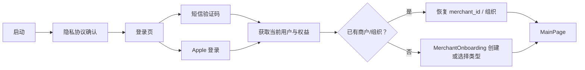

- **已验证（静态）：**登录页、验证码页、Apple 登录 entitlement、`LoginUseCase`、`GetCurrentUserUseCase`、`MerchantOnboardingController`、`merchant_id` 和组织切换接口均存在。
- **已验证（App Store 2.12）：**新增 Apple 登录与手机号绑定。
- **待动态确认：**首次登录是否强制创建商户、个人账号是否自动生成默认组织、离线首页的可见模块。

### 5.2 流程二：首页 Quick Note 快捷记录

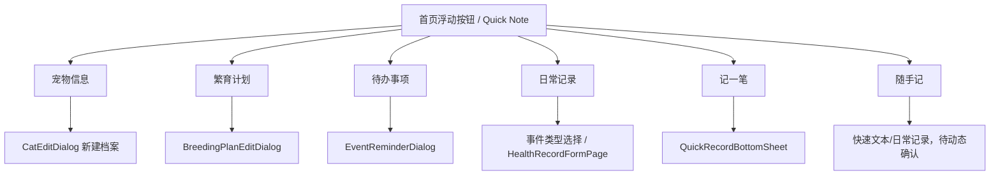

- **已验证（App Store 展示）：**上述入口在当前快捷记录截图中可见。
- **已验证（静态）：**对应 Dialog、Page、Controller 和新增方法存在。
- **熊舍借鉴：**保留同一浮动入口，首屏六项调整为“仓鼠建档、配对计划、窝次记录、称重、待办、记一笔”。

### 5.3 流程三：个体档案全生命周期

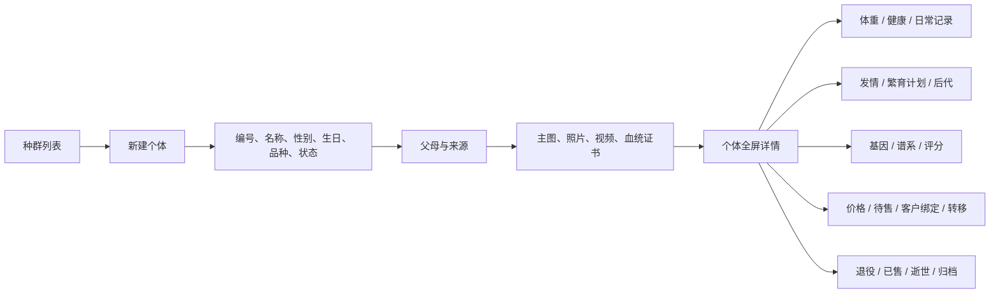

静态可见的主要字段与能力：

```text
cat_no、cat_name、nickname、gender/sex、birth_date、breed、variety、color
microchip_id、category_id、level、tag_ids、price、status、sterilization
is_for_breeding、father_id、mother_id、sire_id、dam_id、notes、thumb
photos、videos、pedigree certificates、gene photos
```

- **已验证（静态）：**新建、编辑、快速更新、批量更新、父母编辑、价格/分类/等级/标签更新、标记逝世与撤销逝世均有方法或组件证据。
- **已验证（App Store 2.11）：**已逝世状态全链路与筛选面板。
- **待动态确认：**哪些字段必填、编号生成规则、外部宠物与自家宠物的字段差异、删除与归档的权限边界。

### 5.4 流程四：繁育计划状态推进

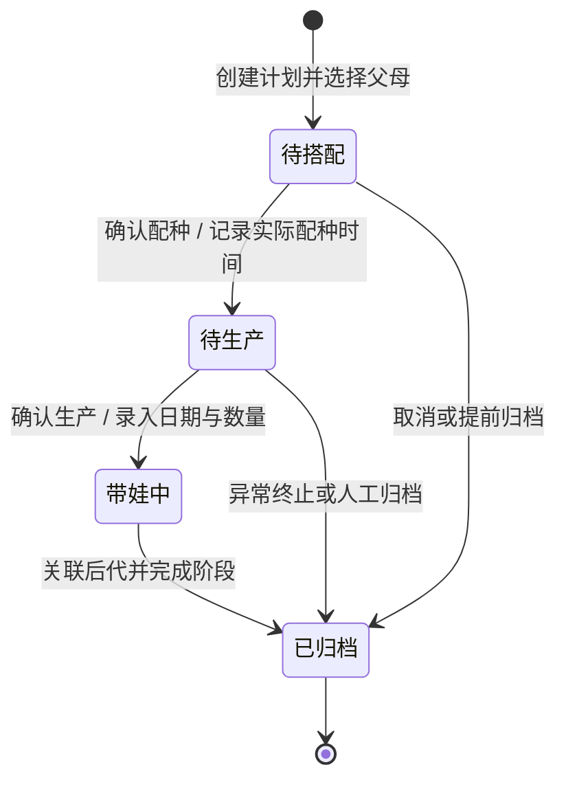

**状态证据：**

- App Store 当前孕期截图可见“全部、带娃中、待生产、待搭配、已归档”；
- 公开管理端前端存在枚举 `{0: 待搭配, 1: 待生产, 2: 带娃中, 3: 已归档}`；
- App Store 2.11 更新历史明确说明“列表滑动操作、确认对话框、上下文卡片与状态推进”；
- AOT 存在 `ConfirmBreedingDialog`、`ConfirmProductionDialog`、`ConfirmArchiveDialog`、`confirmBreeding`、`confirmProduction`、`archivePlan`。

已还原的计划字段与动作：

| 阶段 | 已见字段/操作 | 状态 |
|---|---|---|
| 创建 | 父母、计划名称、繁育备注、计划日期/月、目标后代、品种标准、公开展示 | 已验证（静态） |
| 配种 | 实际配种日期、关联发情周期、配种日志、媒体、配种次数/时长 | 已验证（静态） |
| 孕期 | 预计生产天数/日期、孕期天数、母体与后代体重图、AI 孕期建议 | 已验证（静态） |
| 生产 | 实际生产日期、生产数量、确认生产、报喜卡/海报 | 已验证（静态 + App Store 2.15） |
| 带娃 | 后代关联、整窝/个体体重、日常记录、疫苗待办 | 已验证（静态） |
| 结束 | 归档、分享、后代墙 | 已验证（静态） |

- **待动态确认：**状态是否允许回退、异常生产如何记录、状态推进时服务端校验、滑动菜单具体按钮及权限。

### 5.5 流程五：幼崽体重监护与异常提醒

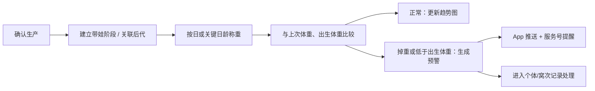

- **已验证（App Store 2.15）：**关键日龄自动比对、掉重/跌破出生体重预警、双通道提醒。
- **已验证（静态）：**`WeightRecordDialog`、`WeightChartCard`、`CatWeightController`、`WeightAlertApiService`、`WeightAlertSettingsPage`、`_loadOffspringWeights`、`_populateOffspringWeights`。
- **App Store 当前孕期截图：**展示多只幼崽的多折线体重曲线和“记录”入口。
- **熊舍借鉴：**该流程应升级为熊舍管家 MVP 核心能力，单位默认克，并支持整窝总重/均重与批量连续录入。

### 5.6 流程六：健康记录、提醒与记账联动

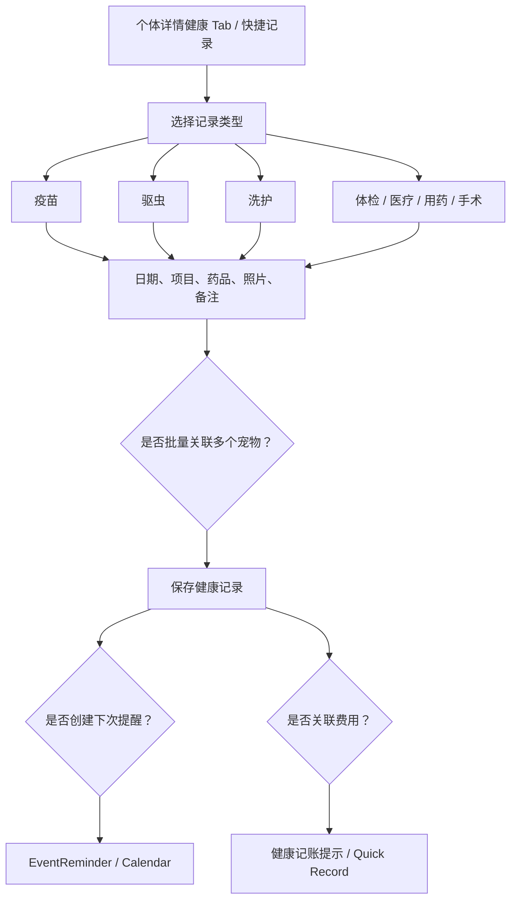

- **已验证（静态）：**`HealthRecordFormPage`、疫苗/驱虫字段构建方法、媒体上传、多宠记录、提醒服务与健康记账映射器均存在。
- **已验证（App Store 2.14）：**寄养/洗护登记可关联宠物档案并记录疫苗、驱虫及上传凭证。
- **待动态确认：**不同健康类型的必填字段、批量保存的拆分方式、是否自动计算下一次提醒日期。

### 5.7 流程七：日历、待办、多阶段与单宠完成

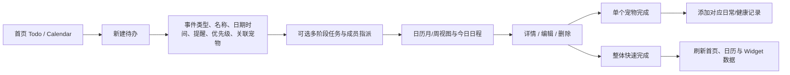

静态字段包括：

```text
event_name、event_type、event_date、event_time、event_status、event_desc
reminder_date、remind_date、remind_time_str、priority、repeat、cat_ids
completed_cat_ids、completed_at、completed_stages
```

- **已验证（App Store 2.7）：**多阶段任务流转、成员指派、阶段进度、优先级与状态展示。
- **已验证（App Store 2.3.1）：**支持勾选单个宠物完成并显示添加记录按钮。
- **已验证（静态）：**创建、更新、删除、快速完成、按宠物确认/取消提醒、Widget 同步方法均存在。
- **待动态确认：**重复规则编辑器、延期/跳过、阶段依赖、成员通知和跨端同步细节。

### 5.8 流程八：经营事项主动登记

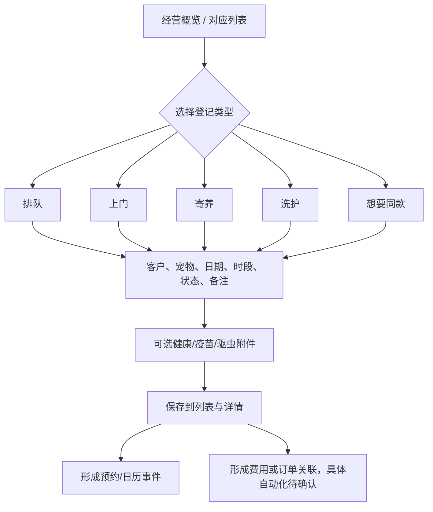

- **已验证（App Store 2.14）：**商户可主动登记、编辑、删除排队、上门、洗护、寄养、想要同款；支持熟客口头预约录入。
- **已验证（静态）：**五类 `RegisterSheet`、客户/宠物选择器、日期、时段、状态、服务、图片和详情页均存在。
- **待动态确认：**各类型状态枚举、收费字段、日历与财务是否自动写入，还是保存后提供二次入口。

### 5.9 流程九：财务快速记账与报表

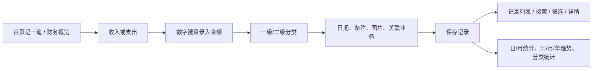

- **已验证（静态）：**`AccountingType`、金额键盘、分类选择、记录列表、详情、日/月报、周支出图、电商报表和健康/销售记账映射。
- **已验证（App Store 展示）：**财务页展示周/月/年/全部切换、支出、收入、结余、日均支出和分类详情。
- **待动态确认：**业务记录与记账是否强绑定、删除/冲正逻辑、多人审批和余额模块边界。

### 5.10 流程十：宠舍官网与小程序发布

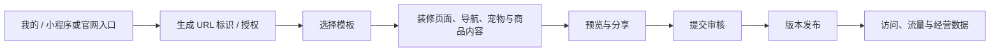

- **已验证（App Store 2.13）：**App 内装修、预览、发布专属宠舍官网，URL 标识默认生成。
- **已验证（静态）：**管理、商店、审核、发布、模板、编辑器、二维码和流量页面/Service 均存在。
- **已验证（公开前端）：**Web 工作台存在种群、繁育、商品、订单、导航、门面、文章、SEO、微信授权/审核/版本等路由。
- **待动态确认：**官网与微信小程序是否共用同一内容模型、发布审核状态、App 内 WebView 与原生页的切换边界。

---

## 6. 宠舍管家到熊舍管家的页面映射建议

### 6.1 一级导航建议

熊舍管家首版推荐使用 **“今日、仓鼠、笼舍、繁育、我的”** 五个一级入口。宠舍管家的独立日历能力并入“今日”，作为日程视图和二级入口；这样既保留统一事件中心，也给仓鼠场景高频的笼盒管理腾出一级位置。

| 宠舍管家结构 | 熊舍管家推荐主方案 | 处理 |
|---|---|---|
| 首页 Overview | **今日**：今日待办、孕期母鼠、待分笼窝次、异常体重、待清洁笼盒、日程简报 | 保留模块化工作台，吸收 Calendar 的高频信息 |
| 种群 Cats | **仓鼠**：个体、窝次、外来鼠、已交付/已逝世 | 改名并扩展“窝次”入口 |
| Door/Boarding 等资源能力 | **笼舍**：笼架、层位、笼盒、入住、移笼、配对、隔离、清洁 | 深度重构并提升为首版一级入口 |
| 繁育计划 | **繁育**：配对、孕期、带崽、断奶/分笼、归档 | 深度重构状态机 |
| 日历 Calendar | 并入 **今日**：繁育、称重、清洁、用药、交付、回访；完整月/周视图作为二级页 | 不单独占用首版 Tab；后续可按使用数据调整 |
| 我的 Profile | **我的**：熊舍资料、成员、客户、财务、导出和设置 | 保留账户与组织管理，笼盒业务移至“笼舍” |

### 6.2 页面级映射

| 宠舍页面/组件 | 熊舍页面建议 | 必须调整的仓鼠字段或规则 | 优先级 |
|---|---|---|---:|
| `CatsPageContent` | 仓鼠列表 | 编号、物种、品系、性别、笼盒、阶段、来源、状态；支持按笼架排序 | MVP |
| `CatEditDialog` | 仓鼠建档 | 物种、品系、毛色/花纹/毛型、耳型、来源、出生窝次、当前笼盒 | MVP |
| `CatDetailPage` | 仓鼠详情 | 当前笼盒、体重、日龄、谱系、配对历史、健康、交付与移笼时间线 | MVP |
| `CatParentEditSheet` | 父母/来源关联 | 支持同窝批量建档时自动继承父母与窝次 | MVP |
| `CatWeightPage` | 个体称重 | 单位默认克；连续称重；日变化率、周变化率与年龄参考 | MVP |
| `WeightRecordDialog` | 快速称重面板 | 支持按笼盒连续录入和蓝牙秤后置接入 | MVP/P2 |
| `BreedingPlanTabPage` | 配对与繁育看板 | “待搭配”拆成计划中/观察中；增加分笼截止、疑似孕期、待产、带崽、断奶、分性、分笼 | MVP |
| `BreedingPlanEditDialog` | 配对计划 | 公鼠、母鼠、开始/结束时间、目标性状、近亲检查、冲突观察、分笼截止 | MVP |
| `ConfirmBreedingDialog` | 配对结果确认 | 已交配/未观察到/冲突终止；必须记录实际分笼时间 | MVP |
| `ConfirmProductionDialog` | 产仔确认 | 产仔日期、出生数、存活数、母鼠状态、所在笼盒、是否进入免打扰期 | MVP |
| `LitterManagementModule` | 窝次管理 | 先按窝记录；数量变化、整窝总重/均重、照片、母鼠状态 | MVP |
| `OffspringCard` | 幼崽卡 / 批量拆档 | 日龄、临时编号、性别判断、毛色、留种/预订、批量建个体 | MVP |
| `VaccineTodoDialog` | 日龄节点任务 | 替换为开眼观察、补充喂养、断奶、分性、分笼、笼盒清洁 | MVP |
| `EstrusTabContent` | 配对观察 | 按物种规则配置适配窗口，不照搬猫发情周期 | MVP |
| `PedigreeTreePage` | 多代谱系 | 共同祖先、亲缘系数、禁配原因、同窝关系；标记证据可信度 | MVP/P1 |
| `BreedingSimulatorPage` | 遗传模拟 | 物种隔离规则、毛色/花纹位点、推测与实测基因型、置信度 | P1 |
| `HealthRecordFormPage` | 健康记录 | 牙齿、颊囊、眼鼻、皮毛、呼吸、步态、排泄、伤口、隔离、用药 | MVP |
| 疫苗/驱虫/洗护卡 | 护理/用药/清洁卡 | 删除猫舍默认疫苗流程，改为物种规则与个体医嘱 | MVP |
| `EventReminderDialog` | 护理任务 | 关联个体、窝次、笼盒或客户；支持相对日龄、重复、延期、完成 | MVP |
| `CalendarPage` | 熊舍日程 | 预产窗口、分笼截止、窝次日龄、称重、清洁、用药、交付 | MVP |
| `QuickRecordBottomSheet` | 快捷记录 | 建档、配对、产仔、称重、健康、清洁、记账 | MVP |
| Door/Boarding 页面 | 笼盒与入住记录 | 重构为笼架—层位—笼盒、移笼、临时配对、隔离、待清洁 | MVP |
| Queue/Wish 页面 | 意向与预订 | 合并为幼崽意向、候补、预订和交付队列 | P1 |
| User/Member 页面 | 客户与团队 | 客户、领养人、合作熊舍；舍主、繁育员、饲养员、客服权限 | P1 |
| Financial 页面 | 熊舍财务 | 粮食、垫料、设备、医疗、物流、交付收入；按个体/窝次/笼盒归集 | P1 |
| Contract/Receipt | 交付协议与收据 | 健康说明、饲养须知、回访约定、订金/尾款 | P1 |
| Miniprogram/Website | 熊舍公开主页 | 展示个体/窝次、预订申请、科普文章和联系方式 | P2 |
| AgentWorkbench | AI 熊舍助手 | 首期只读查询与生成摘要；结构化写操作逐项开放 | P2 |

### 6.3 熊舍管家建议的繁育页面状态

> 本节是用于页面分组、筛选标签和原型跳转的**展示简化态**；完整领域状态、异常分支和迁移约束以《02-繁育窝仔与分笼状态机》为规范。

宠舍管家的四段式状态适合做视觉骨架，但仓鼠周期更短、分笼风险更高，页面展示建议拆成：

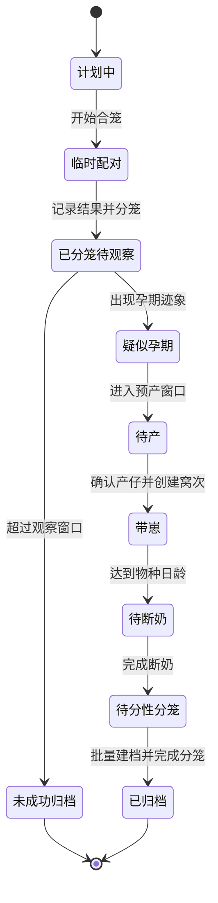

关键产品约束：

1. `临时配对` 必须记录开始时间和最晚分笼时间；
2. 从 `临时配对` 推进前必须确认已分笼；
3. `确认产仔` 必须创建 `Litter/窝次`，不强制立即创建每只幼崽；
4. `待分性分笼` 必须具备批量辨性、批量建档、批量分配笼盒；
5. 所有自动日期必须由物种规则计算，同时允许人工修正并保留修改原因；
6. 个体、配对、孕期、窝次、幼崽和笼盒之间必须保留完整关联链。

---

## 7. 待动态确认清单

### P0：直接影响熊舍 PRD 与原型

1. `MainPage` 实际 Tab 数量、顺序、角色可见性和 iPad 分栏行为；
2. 首页 Quick Note 每个入口的准确落点与“随手记”数据类型；
3. `CatEditFormContent` 全字段、必填项、默认值、分区顺序和校验文案；
4. `BreedingPlanEditDialog` 字段依赖、默认预产天数、跨品种校验和公开展示规则；
5. 四个繁育状态的服务端值、允许迁移、回退/异常终止与滑动菜单操作；
6. 确认生产后是否自动创建窝次、提醒、报喜卡和幼崽体重任务；
7. 待办多阶段、成员指派、单宠完成与添加记录的完整交互；
8. 健康记录批量保存、下次提醒与财务记录之间是自动联动还是二次确认。

### P1：影响经营模块

1. 排队、上门、寄养、洗护、心愿单的状态枚举和字段差异；
2. 客户、会员、订单、积分、余额与宠物绑定关系；
3. 借配交易的邀请、履约、费用、日志和结束条件；
4. 合同、回执、订单和记账之间的关联主键；
5. 角色权限对编辑、删除、归档、财务和导出的具体限制。

### P2：影响增长与平台化

1. 宠舍官网与微信小程序的内容模型是否共用；
2. 模板编辑器、审核、发布和版本回滚流程；
3. AI Agent 43 个工具的实际写入确认机制；
4. Widget、服务号、App 推送和本地通知的去重与完成同步。

---

## 8. 逆向证据摘要

### 8.1 主二进制

```text
路径：/Applications/Cattery Manager.app/Wrapper/Runner.app/Frameworks/App.framework/App
大小：25,039,536 bytes
SHA-256：8bb590bb7a059f7d4078c3fafe4a366938f3ae9f359fa462f29c030bbadd69b8
```

### 8.2 当前公开前端

```text
cattery-admin/index-CrBM-NNt.js
SHA-256：5572f7031d4132799c29e9218173c6874269cb620cd616fe04142e5d8be43830

cattery-editor/index.CrUsb8be.js
SHA-256：165b63693744cc94ddc26b8b6eb9cf2f1cba19b2df72321a9cc7e26489d956
```

公开管理端至少可定位 `75` 条 `/ws`、`/ws-mobile` 或定价相关路由对象，包含：

```text
/ws/cats/list                  我的种群
/ws/cats/plane                 繁育计划
/ws/sale/loan/list             借配管理
/ws/sale/queue/list            排队管理
/ws/sale/door/list             上门管理
/ws/orders/list                订单管理
/ws/goods/list                 商品管理
/ws/users/list                 用户列表
/ws/tags/list                  标签管理
/ws/variety/list               品种管理
/ws/shop/list                  店铺装修
/ws/weixin/mini                微信小程序/授权
/ws/weixin/audit               提交审核
/ws/weixin/version             小程序版本管理/发布
```

这些 Web 路由并不等同于 App 原生路由，但与 App 的页面、Service 和 App Store 宣传能力形成相互印证。

---

## 9. 交付状态

- **已写入：**宠舍管家页面模块、主导航、Controller / Binding、信息架构、十条核心业务流程与熊舍页面映射建议。
- **已验证：**页面路径数量、核心路由、主要 Controller / Binding、App Store 当前入口、繁育四段状态、快捷记录、谱系、财务、官网/小程序和公开管理端路由。
- **待确认：**运行态 Tab 顺序、页面字段必填规则、权限差异、繁育状态迁移请求、通知联动和经营事项自动记账边界。
