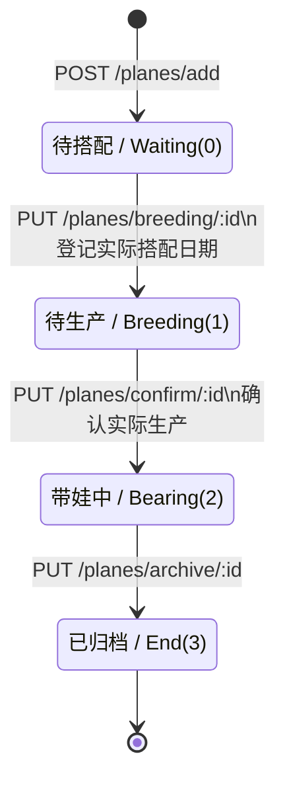
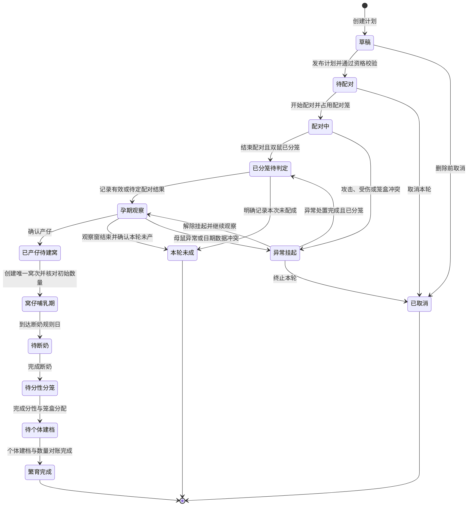

# 熊舍管家：繁育、窝仔与分笼状态机

> 文档版本：v0.1  
> 形成日期：2026-07-15  
> 目标：从“宠舍管家”静态证据中还原可确认的繁育骨架，并转化为适用于仓鼠繁育管理的产品状态机。  
> 范围：配对、分笼、孕期观察、产仔、窝仔、断奶、分性、个体建档，以及相关提醒、校验和异常分支。

## 1. 证据口径

本文统一使用以下标记，避免把静态线索当成已跑通的服务端行为：

- **已验证**：已在 iOS Flutter AOT、公开生产前端 JavaScript 或现有逆向报告中直接看到的类名、字段、枚举、文案或路由。这里的“已验证”仅代表产物证据成立。
- **产品推导**：根据仓鼠繁育业务，为“熊舍管家”设计的目标状态、规则或数据结构。
- **待确认**：需要登录后的真实请求、响应或交互流程才能确定的宠舍管家行为。

主要依据：

1. `/Users/snowchan27/ScolvAtom/开发日志/2026/07/2026-07-14 · Cattery Manager iOS Flutter 静态逆向分析.md`
2. `/Users/snowchan27/ScolvAtom/开发日志/2026/07/2026-07-14 · Cattery Manager 动态启动阻断与 WebView 前端核验.md`
3. `/Applications/Cattery Manager.app/Wrapper/Runner.app/Frameworks/App.framework/App`
4. 公开生产前端 `https://cdn.fanmeowy.com/cattery-admin/assets/index-CrBM-NNt.js`
5. `/Users/snowchan27/Documents/scolvpet/reverse-evidence/appstore/lookup.json`
6. `/Users/snowchan27/Documents/scolvpet/reverse-evidence/appstore/release-history.md`

---

## 2. 宠舍管家可还原的繁育骨架

### 2.1 已验证的四级状态

公开生产前端中存在以下枚举和中文映射：

```text
Waiting = 0  -> 待搭配
Breeding = 1 -> 待生产
Bearing = 2  -> 带娃中
End = 3      -> 已归档
```

同时可见状态辅助字段：`isWaiting`、`isBreeding`、`isBearing`、`isEnd`。

| 数值 | 内部状态 | 中文文案 | 已验证字段/界面证据 | 可推断的业务含义 |
|---:|---|---|---|---|
| 0 | `Waiting` | 待搭配 | `plane_breeding_date`、`Create a new breeding plan` | 已创建计划，尚未登记实际搭配 |
| 1 | `Breeding` | 待生产 | `actual_breeding_date`、`expected_production_days`、预计生产时间 | 已确认搭配，进入待产跟踪 |
| 2 | `Bearing` | 带娃中 | `actual_production_date`、`Actual Birth`、`Litter Size`、`isProduction` | 已确认生产，正在管理后代 |
| 3 | `End` | 已归档 | `archive_breeding_plan`、`/archive/:id` | 当前繁育计划结束并归档 |

### 2.2 已验证的路由、实体和动作

| 证据类型 | 已验证内容 | 能说明的问题 |
|---|---|---|
| 计划接口 | `GET /api/admin/cat/planes`、`POST /add`、`GET /detail/:id` | 计划是独立业务实体 |
| 确认搭配 | `PUT /api/admin/cat/planes/breeding/:id` | 存在从待搭配进入待生产的专门动作 |
| 修正搭配日期 | `PUT /api/admin/cat/planes/breeding/:id/date` | 实际搭配日期可单独修改，预产时间可能随之重算 |
| 确认生产 | `PUT /api/admin/cat/planes/confirm/:id`、`Confirm Production`、`ConfirmProductionRequest` | 存在生产确认动作和独立请求实体 |
| 归档 | `PUT /api/admin/cat/planes/archive/:id` | 生产后的计划可进入归档态 |
| 后代关联 | `PUT /api/admin/cat/planes/update/cats/:id`、`linkOffspring`、`updateOffspringIds` | 后代可在生产后补建档并关联回计划 |
| 窝仔管理 | `LitterManagementController`、`LitterManagementModule`、`loadLitterData`、`offspring_count` | 首页或概览存在窝仔管理入口 |
| 发情周期 | `/api/admin/estrus/cycles`、`EstrusCycle`、`EstrusLog`、`Linked Estrus Cycle` | 发情周期可形成独立记录并链接繁育计划 |
| 交配日志 | `MatingLog`、`addMatingLog`、`Actual Mating Time`、`mating_count`、`mating_duration` | 一次计划内可能保留多次交配观察日志 |
| 预产计算 | `expected_production_days`，前端以 `actual_breeding_date + expected_production_days` 计算预计生产日 | 预产日期来自实际搭配日和预计天数 |
| 窝仔体重 | `/weights/:id`、`/weights/:id/update`、`/weights/:id/delete`、`_populateOffspringWeights` | 计划详情支持后代体重录入与修正 |
| 幼崽体重监护 | App Store 2.15.0：关键日龄称重自动与上次及出生体重比较，掉重或跌破出生体重后通过服务号与 App 双通道提醒 | 体重记录已经形成“基准比较—异常判定—多通道通知”闭环 |
| 状态推进交互 | App Store 2.11.0：繁育计划确认对话框包含上下文卡片与状态推进 | 状态转换通过带上下文的确认动作呈现，而非普通字段编辑 |
| 生产报喜卡 | App Store 2.15.0：确认生产成功即弹出报喜卡，可生成海报保存或分享；AOT 同时可见 `BirthPosterSheet`、`BirthCelebrationSheet` | 生产确认除了改状态，还会触发庆祝与分享副作用 |
| 提醒 | `/api/admin/cat/planes/remind/:id`、`BreedingPlanReminder`、`SmartReminderButton`、`notify_time` | 繁育计划拥有独立提醒，并可映射到通用事件提醒体系 |
| 多阶段待办 | App Store 2.7.0：待办支持多阶段流转、成员指派、优先级和任务状态；2.3.1 支持按单个宠物完成并添加记录 | 繁育里程碑可拆成阶段任务，并按单只幼崽核销 |
| 体重采集 | App Store 2.3.0：适配蓝牙厨房秤；2.7.0：繁育体重趋势按天聚合 | 体重输入既支持手工也支持硬件，趋势统计以日为粒度 |
| 后代预测 | App Store 2.3.0：新增繁育计划后代预测；AOT 可见 `SuggestedOffspring`、`getSuggestedOffspring` | 配对前可展示后代预测，但其结果不直接替代人工确认的谱系事实 |
| Widget | `widget_breeding_plans`、`/api/admin/cat/bepro/planes` | 繁育计划摘要会同步到桌面组件 |

### 2.3 宠舍管家的高概率状态转换

下面的状态名称和接口均有静态证据；接口与状态变化的精确服务端绑定仍属待确认。



### 2.4 原模型对熊舍业务的不足

宠舍管家的四级状态足以表达“计划—待产—带娃—结束”，但仓鼠业务还需要显式表达：

1. **配对结束后是否已分笼**：这是操作闭环，不应只保存在备注里。
2. **一次计划中的多次配对尝试**：每次开始、结束、结果和父本归属均应保留。
3. **预产日应为区间**：由物种规则的最小/最大孕期计算，而非只保存单一预计天数。
4. **窝仔早期按整窝管理**：新生阶段通常先管理数量和整窝观察，后续再拆成个体。
5. **断奶与分性是独立里程碑**：二者需要分别验收，并与笼盒占用联动。
6. **个体建档必须对账**：存活、死亡、转出、待识别、已建档数量必须闭合。

---

## 3. 熊舍管家的状态建模原则

以下均为**产品推导**。

### 3.1 三条状态轴，避免单字段爆炸

建议将状态分为三条相互校验的轴：

| 状态轴 | 负责内容 | 示例 |
|---|---|---|
| 繁育计划轴 `breeding_plan.state` | 整体进度和业务入口 | 待配对、配对中、孕期观察、窝仔管理、完成 |
| 窝次轴 `litter.state` | 产仔后的幼崽阶段 | 新生、哺乳、待断奶、待分性、待建档、已关闭 |
| 笼盒占用轴 `cage_assignment.state` | 配对和分笼是否真正落地 | 预留、配对占用、单鼠占用、待清洁、释放 |

主计划状态只负责导航；窝仔和笼盒分别保存自己的事实。这样能够表达“计划已进入孕期，但配对笼仍待清洁”或“窝仔已断奶，但仍有两只性别待确认”等真实情况。

### 3.2 事件驱动而非直接改状态

每次状态变化由领域事件触发，事件保留操作人、发生时间、录入时间、前后值和备注。历史日期修正通过补充纠正事件完成，并重新计算受影响的提醒。

### 3.3 生物规则参数化

孕期、断奶、分性、繁育年龄、休养间隔等均从 `species_rule_version` 读取。规则至少包含：

- `GESTATION_MIN_DAYS`
- `GESTATION_MAX_DAYS`
- `WEANING_TARGET_DAYS`
- `SEX_SEPARATION_TARGET_DAYS`
- `PAIRING_MAX_DURATION`
- `POST_BREEDING_REST_DAYS`
- `PROFILE_CREATION_DEADLINE_DAYS`

规则需记录物种、品系、版本、生效日期和资料来源；计划创建后保存规则快照，防止规则升级改写历史结果。

---

## 4. 熊舍管家主状态机

### 4.1 Mermaid 状态图



### 4.2 状态表

| 状态码 | 展示名称 | 进入条件 | 必填事实 | 允许的核心操作 | 正常退出事件 |
|---|---|---|---|---|---|
| `DRAFT` | 草稿 | 新建计划 | 母鼠、候选父鼠、规则版本 | 编辑、保存、取消 | `PLAN_PUBLISHED` |
| `PAIR_READY` | 待配对 | 资格校验通过 | 计划配对时间、配对笼预留 | 开始配对、改期、取消 | `PAIRING_STARTED` |
| `PAIRING` | 配对中 | 已创建配对尝试并占用笼盒 | 开始时间、参与个体、笼盒 | 记录观察、记录交配、立即分笼 | `PAIRING_SEPARATED` |
| `POST_PAIR` | 已分笼待判定 | 公母均已离开配对笼并有新笼位 | 结束时间、分笼时间、结果、双方笼位 | 判定有效、判定未成、补证据 | `GESTATION_MONITORING_STARTED` 或 `PAIRING_FAILED` |
| `GESTATION` | 孕期观察 | 有有效或待定配对尝试 | 基准交配时间、预产区间、母鼠笼位 | 体重/观察记录、修正日期、确认产仔、确认未产 | `BIRTH_CONFIRMED` 或 `NO_BIRTH_CONFIRMED` |
| `BIRTH_RECORDED` | 已产仔待建窝 | 首次确认生产 | 实际产仔时间、初始活仔数、其他结果数 | 创建窝次、修正生产记录 | `LITTER_CREATED` |
| `LITTER_NURSING` | 窝仔哺乳期 | 唯一窝次创建成功 | 母鼠、窝次、出生时间、数量账 | 整窝观察、数量变更、照片、称重 | `WEANING_DUE_REACHED` |
| `WEANING_DUE` | 待断奶 | 达到规则日或人工提前发起 | 断奶时间、当前存活数、去向笼盒 | 完成断奶、登记异常 | `WEANING_COMPLETED` |
| `SEX_SEPARATION_DUE` | 待分性分笼 | 断奶完成 | 每只/每组性别结果、性别置信度、笼盒分配 | 批量分性、复核、分笼 | `SEX_SEPARATION_COMPLETED` |
| `INDIVIDUALIZING` | 待个体建档 | 分性和分笼完成 | 每只幼崽的临时编号或永久档案映射 | 批量建档、关联谱系、登记转出/死亡 | `LITTER_RECONCILED` |
| `COMPLETED` | 繁育完成 | 窝仔数量闭合，待办已处理 | 汇总结果、完整谱系链接 | 查看、导出、纠错申请 | `PLAN_ARCHIVED` |
| `HOLD` | 异常挂起 | 出现影响继续推进的异常 | 异常类型、发生时间、处置人 | 记录健康事件、分笼、恢复或终止 | `HOLD_RELEASED` / `PLAN_CANCELLED` |
| `UNSUCCESSFUL` | 本轮未成 | 配对失败或预产观察结束后确认未产 | 失败阶段、原因、确认时间 | 复制为新计划、归档 | 终态 |
| `CANCELLED` | 已取消 | 配对前取消或异常后终止 | 取消原因、操作人 | 查看、复制计划 | 终态 |

### 4.3 关键设计说明

1. **`PAIRING` 的退出动作必须同时完成分笼事实。** 点击“结束配对”时，界面要求选择双方去向笼盒；若现场紧急，可先进入 `HOLD`，但持续显示“分笼未闭环”的最高优先级任务。
2. **`GESTATION` 表示孕期观察，不代表医学确诊。** 状态来源是有效或待定的配对事实，用于计算观察区间和提醒。
3. **`BIRTH_RECORDED` 与 `LITTER_NURSING` 分开。** 生产确认采用幂等事件，随后创建唯一窝次；即使建窝步骤中断，也不会重复生成多个窝次。
4. **断奶与分性分别验收。** 断奶是饲养阶段变化，分性分笼是个体和笼盒关系变化，两者保留各自时间与操作人。
5. **个体档案后建、谱系自动继承。** 幼崽个体档案从窝次批量生成，自动继承父母、出生日期、物种/品系和计划编号。
6. **确认生产可触发非阻塞式报喜卡。** 报喜卡生成失败不回滚生产事实；再次打开计划可重新生成，避免分享功能影响核心状态。
7. **窝仔阶段内置体重监护。** 每条幼崽体重记录保存本次、上次和出生基准的比较结果；异常提醒是记录后的副作用，不覆盖原始称重值。

---

## 5. 领域事件、校验与副作用

### 5.1 核心事件表

| 事件 | 发起方式 | 前置校验 | 状态变化 | 主要副作用 |
|---|---|---|---|---|
| `PLAN_PUBLISHED` | 用户发布计划 | 父母资料完整；不是同一个体；无冲突中的繁育计划；规则资格通过或有备注确认 | `DRAFT -> PAIR_READY` | 预留配对笼；生成配对提醒 |
| `PAIRING_STARTED` | 扫描笼码或点击开始 | 配对笼可用；双方当前笼位明确；操作时间合法 | `PAIR_READY -> PAIRING` | 创建 `pairing_attempt`；笼盒状态改为配对占用；启动超时提醒 |
| `MATING_OBSERVED` | 配对中记录 | 配对尝试仍进行中；观察时间位于开始和结束之间 | 状态不变 | 添加交配日志、媒体和置信度；更新预产基准候选时间 |
| `PAIRING_SEPARATED` | 点击结束并选择去向笼盒 | 结束时间不早于开始；双方均有去向；去向笼盒无冲突 | `PAIRING -> POST_PAIR` | 关闭配对占用；创建双方单鼠占用；关闭超时提醒 |
| `GESTATION_MONITORING_STARTED` | 用户确认结果为有效或待定 | 至少有一次配对尝试；分笼已闭环 | `POST_PAIR -> GESTATION` | 计算预产区间；生成孕期观察和产仔提醒 |
| `PAIRING_FAILED` | 用户确认未配成 | 所有尝试已结束；无待处理分笼 | `POST_PAIR -> UNSUCCESSFUL` | 关闭本轮提醒；保留复制新计划入口 |
| `BIRTH_CONFIRMED` | 用户录入实际产仔 | 实际时间合法；母鼠和笼位明确；同一计划尚无有效生产事件 | `GESTATION -> BIRTH_RECORDED` | 冻结产仔时间；关闭预产提醒；创建待建窝任务；生成可重试的报喜卡 |
| `LITTER_CREATED` | 确认初始数量 | 活仔数及其他结果数均为非负整数；计划尚无有效窝次 | `BIRTH_RECORDED -> LITTER_NURSING` | 创建唯一窝次；生成窝仔观察、断奶、分性提醒 |
| `LITTER_COUNT_ADJUSTED` | 整窝观察中修正 | 新旧数量差值必须有原因；发生时间不早于出生 | 状态不变 | 写入不可覆盖的数量流水；重算当前存活数 |
| `PUP_WEIGHT_RECORDED` | 手工录入或蓝牙秤采集 | 幼崽临时身份存在；重量与时间合法；同次采集无重复 | 状态不变 | 与上次及出生体重比较；更新按日趋势；必要时生成掉重预警 |
| `PUP_WEIGHT_ALERTED` | 规则引擎自动触发 | 命中掉重、跌破出生体重或其他已配置阈值 | 状态不变 | 创建高优先级待办；按通道配置发送 App/服务号提醒；记录送达状态 |
| `WEANING_COMPLETED` | 批量完成断奶 | 当前存活幼崽全部有断奶结果；去向笼盒容量和状态通过校验 | `WEANING_DUE -> SEX_SEPARATION_DUE` | 写入断奶时间；生成分性分笼任务 |
| `SEX_SEPARATION_COMPLETED` | 批量分性并分笼 | 每只或每组均有性别结果；性别待定者有独立临时安排；笼位无冲突 | `SEX_SEPARATION_DUE -> INDIVIDUALIZING` | 生成临时幼崽编号；建立分性后的笼盒占用 |
| `PUP_PROFILE_LINKED` | 批量建档或关联已有档案 | 档案未重复关联；父母及窝次一致 | 状态不变 | 写入永久个体 ID；自动生成谱系边 |
| `LITTER_RECONCILED` | 用户提交对账 | 数量公式闭合；无性别待复核；无幼崽缺少去向 | `INDIVIDUALIZING -> COMPLETED` | 关闭剩余任务；形成繁育汇总 |
| `PLAN_ARCHIVED` | 自动或人工归档 | 计划已完成或有带原因的终止结论 | `COMPLETED -> 归档只读` | 生成导出快照；保留纠错审计入口 |

### 5.2 数量对账公式

推荐采用流水而非直接覆盖 `offspring_count`：

```text
初始活仔数
+ 后补发现数
- 死亡数
- 已转出且不再管理数
= 当前应管理数

当前应管理数
= 已建个体档案数
+ 尚在整窝管理数
+ 待处理异常数
```

提交断奶、分性和最终归档时均执行对账。任何差额都生成 `COUNT_MISMATCH` 异常任务，并显示差额来自哪一段流水。

### 5.3 父母与谱系校验

发布计划前至少执行：

1. 父鼠和母鼠 ID 不同，性别及繁育角色满足当前规则模板。
2. 个体状态不是死亡、转出、退役或被其他进行中计划占用。
3. 年龄、休养间隔、历史窝次等满足 `species_rule_version`；人工放行必须填写原因。
4. 计算共同祖先和近亲层级，风险达到阈值时要求二次确认并写入审计。
5. 每次重新配对创建新的 `pairing_attempt`，不覆盖上一轮开始、结束和父本记录。

### 5.4 笼盒校验

1. 同一时间段内，一个笼盒只允许一个有效占用关系；配对占用作为特殊关系保存双方 ID。
2. 结束配对后，双方必须各自拥有有效去向；系统自动释放配对笼并创建待清洁任务。
3. 分性完成时，性别不同的幼崽不得被提交到同一普通分组笼；性别待定者进入独立或待复核安排。
4. 删除或改期历史笼位记录时，重新检查后续占用冲突，并保留修改前值。

---

## 6. 异常分支

| 异常码 | 触发场景 | 产品处理 | 恢复条件 |
|---|---|---|---|
| `PAIRING_SAFETY_STOP` | 配对中出现攻击、受伤或强烈应激记录 | 立即停止计时，进入 `HOLD`，首页置顶“完成分笼”，并可一键创建健康事件 | 双方去向笼盒均落地，异常记录已保存 |
| `SEPARATION_INCOMPLETE` | 已结束配对但只登记一方去向 | 保持 `HOLD`，保留配对笼占用，不生成孕期提醒 | 双方笼位完整且无冲突 |
| `PAIRING_UNCERTAIN` | 未观察到明确交配结果 | 允许进入孕期观察，但结果标记为“待定”，提醒文案使用“观察窗” | 用户确认产仔或确认本轮未产 |
| `NO_BIRTH_OVERDUE` | 超过预产区间仍无生产记录 | 创建逾期确认任务，不自动判断结果 | 用户选择继续观察、修正基准时间或确认未产 |
| `DUPLICATE_BIRTH_EVENT` | 重复点击或网络重试提交生产确认 | 以 `plan_id + event_type` 幂等键返回已有结果 | 无需人工恢复 |
| `LITTER_COUNT_MISMATCH` | 活仔流水与当前个体/整窝数量不符 | 阻止完成断奶、分性或归档，并展示差额 | 补录数量变更或修正错误记录 |
| `SEX_UNCERTAIN` | 幼崽性别暂未确定 | 标为待复核，建立独立临时安排和复核提醒 | 性别复核完成并重新执行笼位校验 |
| `CAGE_CONFLICT` | 目标笼盒同时段已有占用 | 保留当前状态，展示冲突对象和时段 | 选择其他笼盒或修正占用记录 |
| `DATE_CORRECTION` | 修正实际交配日或产仔日 | 追加纠正事件，重算所有派生日期并生成提醒变更摘要 | 用户确认新提醒计划 |
| `DAM_OR_PUP_LOSS` | 母鼠或幼崽死亡、转出等生命周期变化 | 写入个体/数量流水，关闭对应待办，但保留繁育计划历史 | 数量对账闭合 |
| `RULE_VERSION_CHANGED` | 物种规则发布新版本 | 已有计划继续使用规则快照，新计划使用新版本 | 用户主动创建新计划或选择经审计的迁移 |

---

## 7. 提醒规则

### 7.1 调度原则

1. 提醒记录保存在服务端；系统通知权限关闭时仍保留站内待办。宠舍管家 AOT 中已有“Reminder will still be saved to server even if disabled”文案，可作为交互参考。
2. 每条提醒使用幂等键：`entity_type + entity_id + rule_code + rule_version + occurrence`。
3. 基准日期被修正时，旧提醒进入 `superseded`，新提醒重新生成；历史记录保留。
4. 状态提前完成时关闭后续同类提醒；状态逾期时只保留一个滚动升级任务，避免每日堆积。
5. 时间统一按熊舍时区生成，保存 UTC 时间和规则计算时区。

待办层采用宠舍管家版本历史中已经出现的多阶段能力：任务包含 `stage`、`assignee_id`、`priority`、`status` 和 `subject_ids`。一个关键日龄称重任务可关联整窝，但每只幼崽独立完成；整窝任务在全部在管幼崽完成或登记例外后自动关闭。

### 7.2 提醒矩阵

| 规则码 | 提醒名称 | 触发公式 | 优先级 | 完成/取消条件 |
|---|---|---|---|---|
| `PAIR_PREP` | 配对准备 | `planned_pairing_at - configured_offset` | 普通 | 开始配对、改期或取消计划 |
| `PAIRING_TIMEOUT` | 配对观察超时 | `pairing_started_at + PAIRING_MAX_DURATION` | 紧急 | 完成分笼；异常停止后转为分笼提醒 |
| `SEPARATE_NOW` | 分笼未闭环 | 配对结束或异常停止后立即生成 | 最高 | 双方有效笼位均已保存 |
| `GESTATION_WINDOW_OPEN` | 进入预产观察窗 | `mating_baseline + GESTATION_MIN_DAYS` | 重要 | 确认产仔、确认未产或修正日期 |
| `GESTATION_WINDOW_CLOSE` | 预产观察窗末日 | `mating_baseline + GESTATION_MAX_DAYS` | 重要 | 确认产仔或确认未产 |
| `NO_BIRTH_REVIEW` | 逾期结果确认 | `window_close + configured_grace` | 最高 | 继续观察、修正日期或确认未产 |
| `LITTER_OBSERVATION` | 窝仔观察 | 由规则模板配置出生后的观察节点 | 普通 | 对应观察记录完成 |
| `PUP_WEIGHT_CHECK` | 关键日龄称重 | 由规则模板对 `birth_at` 配置多个关键日龄 | 重要 | 对当前应监护幼崽逐只完成称重；支持按单只核销 |
| `PUP_WEIGHT_DROP` | 幼崽掉重预警 | `current_weight < previous_weight`，或 `current_weight < birth_weight`；阈值可按规则扩展 | 最高 | 人工查看并添加处理记录；后续称重恢复后关闭或转为持续监护 |
| `WEANING_DUE` | 断奶任务 | `birth_at + WEANING_TARGET_DAYS` | 重要 | 所有当前存活幼崽均有断奶结果 |
| `SEX_SEPARATION_DUE` | 分性分笼 | `birth_at + SEX_SEPARATION_TARGET_DAYS` | 最高 | 性别与笼盒校验全部通过 |
| `SEX_RECHECK` | 性别复核 | 待定幼崽创建后按规则滚动提醒 | 重要 | 性别确认 |
| `PROFILE_CREATION_DUE` | 个体建档 | `sex_separation_completed_at + PROFILE_CREATION_DEADLINE_DAYS` | 普通，逾期升级 | 数量对账与档案关联完成 |
| `REST_PERIOD_END` | 母鼠休养期结束 | `breeding_closed_at + POST_BREEDING_REST_DAYS` | 信息 | 仅更新下次资格日期，不自动创建新计划 |

### 7.3 提醒联动示例

```text
修正实际配对时间
→ 预产区间重算
→ 旧的 WINDOW_OPEN / WINDOW_CLOSE / NO_BIRTH_REVIEW 标记为 superseded
→ 生成新版提醒
→ 给操作人展示“共调整 3 条提醒”的确认摘要
```

---

## 8. 最小数据模型

以下为**产品推导**，字段名用于接口和数据库设计对齐。

### 8.1 `breeding_plan`

```text
id
state
mother_pet_id
planned_father_pet_id
species_rule_version_id
planned_pairing_at
mating_baseline_at
expected_birth_window_start
expected_birth_window_end
actual_birth_at
active_pairing_attempt_id
litter_id
version
created_by / updated_by
created_at / updated_at
```

### 8.2 `pairing_attempt`

```text
id
breeding_plan_id
attempt_no
father_pet_id
mother_pet_id
pairing_cage_id
started_at
ended_at
separated_at
result: effective | uncertain | ineffective | safety_stop
evidence_note
evidence_media_ids
father_destination_cage_id
mother_destination_cage_id
```

### 8.3 `litter`

```text
id
breeding_plan_id
mother_pet_id
father_pet_id
birth_at
state
initial_alive_count
current_managed_count
weaning_completed_at
sex_separation_completed_at
reconciled_at
```

### 8.4 `litter_count_event`

```text
id
litter_id
event_type: initial | discovered | death | transferred_out | correction
delta
occurred_at
reason
operator_id
```

### 8.5 `pup_identity`

```text
id
litter_id
temporary_code
sex: male | female | uncertain
sex_confidence
current_cage_id
pet_profile_id
outcome: active | died | transferred | other
```

### 8.6 `pup_weight_record`

```text
id
litter_id
pup_identity_id
measured_at
weight_grams
source: manual | bluetooth_scale | import
birth_weight_grams
previous_weight_grams
delta_from_birth
delta_from_previous
alert_flags
operator_id
```

同一幼崽同一采集批次使用幂等键去重。比较值作为记录快照保存，规则升级后仍可解释当时为何触发提醒。

### 8.7 `workflow_task`

```text
id
entity_type / entity_id
stage
assignee_id
priority
status: pending | in_progress | completed | cancelled
subject_ids
due_at
completed_subject_ids
completion_record_ids
```

`subject_ids` 支持“整窝任务、逐只完成”：例如一次关键日龄称重任务关联 8 只幼崽，成员可以逐只称重并添加记录，全部完成后阶段进度才达到 100%。

### 8.8 `domain_event` 与 `reminder`

所有状态变化写入 `domain_event`；提醒保存 `rule_code`、`rule_version`、`base_event_id`、`scheduled_at`、`status`、`superseded_by`，以支持审计和日期重算。

---

## 9. 宠舍管家到熊舍管家的状态映射

| 宠舍管家状态 | 熊舍管家承接状态 | 处理方式 |
|---|---|---|
| 待搭配 `Waiting` | `DRAFT`、`PAIR_READY`、`PAIRING`、`POST_PAIR` | 将计划和实际配对拆开，并加入强制分笼闭环 |
| 待生产 `Breeding` | `GESTATION` | 将单一预计生产日扩展为物种规则驱动的预产区间 |
| 带娃中 `Bearing` | `BIRTH_RECORDED`、`LITTER_NURSING`、`WEANING_DUE`、`SEX_SEPARATION_DUE`、`INDIVIDUALIZING` | 把“带娃”拆成仓鼠繁育的五个可验收里程碑 |
| 已归档 `End` | `COMPLETED`、归档只读 | 归档前增加数量、谱系、笼盒和待办对账 |
| 发情周期、交配日志 | `pairing_attempt` 与观察事件 | 保留日志思想；是否展示发情周期由物种规则和产品需求决定 |
| 后续关联幼崽 | `pup_identity -> pet_profile_id` | 保留延后建档，但增加截止提醒和数量强校验 |
| 幼崽体重监护 | `pup_weight_record`、`PUP_WEIGHT_CHECK`、`PUP_WEIGHT_DROP` | 保留上次/出生基准比较和多通道提醒，适配克级体重与临时幼崽编号 |
| 多阶段待办 | `workflow_task.stage`、成员指派、逐只完成 | 用任务进度驱动里程碑验收，状态仍由领域事件统一推进 |
| 生产报喜卡 | `BIRTH_CONFIRMED` 后的独立媒体任务 | 保留分享价值，与核心生产事件解耦并支持失败重试 |

---

## 10. 验收案例

### AC-01 标准完整流程

**Given** 已创建父母档案、物种规则和可用笼盒  
**When** 用户依次完成发布计划、开始配对、分笼、孕期观察、确认产仔、建窝、断奶、分性分笼和个体建档  
**Then** 状态按主链路顺序推进；每一步记录操作人和时间；最终数量对账为零差额，父母与所有个体自动形成谱系关联。

### AC-02 配对异常后立即分笼

**Given** 状态为 `PAIRING`  
**When** 用户选择“攻击/受伤，立即停止”  
**Then** 状态进入 `HOLD`，配对计时停止，生成最高优先级 `SEPARATE_NOW`；双方笼位登记完成后才允许继续孕期观察或终止本轮。

### AC-03 分笼笼位冲突

**Given** 配对已结束  
**When** 用户为母鼠选择一个同时间已有住鼠的笼盒  
**Then** 系统提示冲突对象与时段，保持当前状态，且不释放配对笼占用；换用有效笼盒后一次性提交成功。

### AC-04 配对结果待定

**Given** 已完成分笼但未观察到明确交配  
**When** 用户选择“结果待定，进入观察”  
**Then** 状态进入 `GESTATION`，计划显示“观察窗”而不是“已确认怀孕”，并按预产区间生成提醒。

### AC-05 超过预产区间仍未产仔

**Given** 当前时间晚于 `expected_birth_window_end`  
**When** 尚无生产记录  
**Then** 系统生成单条滚动升级的 `NO_BIRTH_REVIEW`；用户可继续观察、修正配对基准时间或确认本轮未产，系统不自动填写失败结论。

### AC-06 重复提交生产确认

**Given** 同一计划已经存在有效 `BIRTH_CONFIRMED` 事件  
**When** 客户端因网络重试再次提交相同请求  
**Then** 服务端返回已有生产事件和窝次 ID，不创建第二个窝次，状态保持一致。

### AC-07 修正实际配对时间

**Given** 已进入孕期观察并已生成预产提醒  
**When** 用户把实际配对时间从 `T1` 修正为 `T2`  
**Then** 系统追加 `DATE_CORRECTION`，按 `T2` 重算预产区间；旧提醒标记为 `superseded`，新提醒无重复。

### AC-08 窝仔数量变化

**Given** 初始活仔数为 `N`  
**When** 用户录入后补发现 `+A`、死亡 `-B`  
**Then** 当前应管理数为 `N + A - B`；每次变化均保留独立流水，历史初始数不被覆盖。

### AC-09 性别待复核

**Given** 断奶完成，存在性别为 `uncertain` 的幼崽  
**When** 用户提交分性分笼  
**Then** 待定幼崽必须有独立临时安排并生成 `SEX_RECHECK`；计划进入 `INDIVIDUALIZING` 前需满足配置的分笼规则。

### AC-10 数量不闭合时阻止归档

**Given** 当前应管理数为 8，但仅有 7 个个体档案且整窝剩余数为 0  
**When** 用户提交繁育完成  
**Then** 系统创建 `LITTER_COUNT_MISMATCH`，展示差额 1，并保持 `INDIVIDUALIZING`；补录去向或档案后方可完成。

### AC-11 通知权限关闭

**Given** 用户关闭系统通知权限  
**When** 状态变化生成断奶或分性提醒  
**Then** 服务端提醒和应用内待办照常创建，界面提示系统推送未开启，不丢失业务任务。

### AC-12 并发操作

**Given** 两名成员同时打开同一计划版本  
**When** A 已完成分笼，B 仍提交旧版本的“结束配对”  
**Then** 服务端通过 `version` 拒绝旧状态写入并返回最新计划；B 刷新后可查看 A 的操作记录，不产生重复事件。

### AC-13 幼崽掉重双通道预警

**Given** 某幼崽已有出生体重 `W0` 和上次体重 `W1`  
**When** 新称重 `W2` 小于 `W1`，或小于 `W0`  
**Then** 原始称重保存成功，系统生成一个最高优先级 `PUP_WEIGHT_DROP`，关联该幼崽、三组比较值和称重记录；App 推送与已绑定的服务号通道各产生可追踪的发送结果，重复采集请求不重复发警报。

### AC-14 整窝称重任务逐只完成

**Given** 关键日龄任务关联 8 只当前在管幼崽并指派给成员 A  
**When** A 完成其中 6 只，成员 B 接手其余 2 只  
**Then** 阶段进度先显示 `6/8`，每只均可添加独立记录；最后 2 只完成后任务自动关闭，操作人分别保留，窝次状态不因中间换人而重置。

### AC-15 报喜卡生成失败不影响生产确认

**Given** 用户确认产仔时媒体生成服务暂时失败  
**When** `BIRTH_CONFIRMED` 已由服务端成功提交  
**Then** 计划仍进入 `BIRTH_RECORDED`，窝次创建流程照常继续；报喜卡显示“待重试”，用户稍后可重新生成，重试不重复提交生产事件。

---

## 11. 待确认清单

以下内容在宠舍管家中仍需运行时请求或真实交互补证：

1. `PUT /api/admin/cat/planes/breeding/:id` 的请求字段、服务端校验及是否必然写入 `actual_breeding_date`。
2. `PUT /api/admin/cat/planes/confirm/:id` 是否正是 `Breeding -> Bearing`，以及 `ConfirmProductionRequest` 的完整字段。
3. `mating_logs` 多条记录如何选择预产基准，是否支持修改或删除。
4. 发情周期与繁育计划的关联是人工选择还是自动创建。
5. 后代关联接口是否校验父母、出生日期和重复关联。
6. 归档接口对后代数量、体重记录和提醒完成状态是否有前置校验。
7. `/api/admin/cat/planes/remind/:id` 与通用 `/api/admin/common/event/reminds` 的关系、时区和重复提醒策略。
8. Widget 中的繁育状态、倒计时和提醒完成动作是否支持双向同步。
9. 删除计划在四个状态中的权限边界，以及删除后相关提醒、日志和后代关系如何处理。
10. 幼崽体重监护的“关键日龄”具体配置、掉重阈值、是否按单只或整窝启用。
11. 服务号与 App 双通道的去重、送达回执、重试和用户通道绑定条件。
12. 多阶段待办的服务端状态枚举、指派权限，以及按单只完成后如何聚合为整窝阶段进度。

---

## 12. 当前结论

- **已验证：** 宠舍管家存在“待搭配—待生产—带娃中—已归档”四级状态，以及确认搭配、修正搭配日期、确认生产、关联后代、体重记录、提醒和归档等静态证据；App Store 版本历史还确认了状态推进对话框、多阶段待办、逐宠完成、蓝牙秤、关键日龄体重比较、掉重双通道预警和确认生产后的报喜卡。
- **产品推导：** 熊舍管家将四级状态扩展为“配对—分笼—孕期观察—产仔—窝仔—断奶—分性分笼—个体建档”的可验收链路，并以窝次、笼盒、数量流水和领域事件保证闭环。
- **待确认：** 宠舍管家的真实接口载荷、服务端状态守卫、提醒重算和归档约束仍需动态流量验证。
