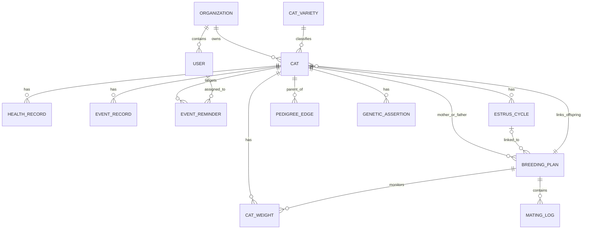
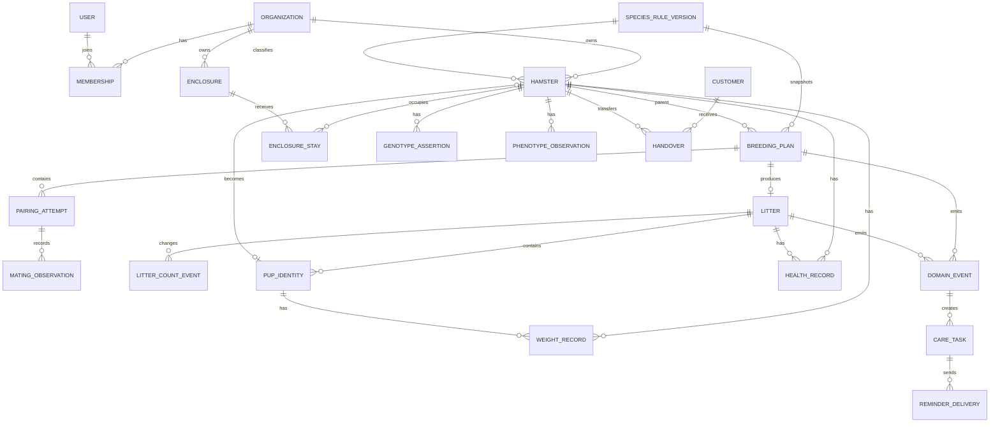

# 核心实体关系与字段字典

> 目标项目：**熊舍管家**  
> 逆向对象：宠舍管家（Cattery Manager）`2.15.0 (73)`  
> 文档版本：v0.1  
> 核验日期：2026-07-15  
> 用途：把静态逆向得到的实体、字段标记、Service 与 API 路由，转换为熊舍管家可用于 PRD、数据库设计和接口设计的领域模型。

## 1. 证据等级

本文严格区分四种信息：

- **V1 已验证实体/路由**：AOT 中存在对应 Entity、Model、Service、页面或 API 字符串。
- **V2 已验证字段标记**：AOT、公开前端或 App Store 文案中直接存在该字段名或业务概念；尚不等于完整请求契约。
- **I 产品推断**：由实体名称、接口动作和页面关系推导出的高概率关系。
- **D 熊舍设计**：为熊舍管家重新设计的数据结构、约束与枚举。
- **T 待确认**：需要登录后的请求/响应、运行态表单或更深层 AOT 调用关系才能确定。

主要证据：

1. `/Applications/Cattery Manager.app/Wrapper/Runner.app/Frameworks/App.framework/App`
2. `/Users/snowchan27/ScolvAtom/开发日志/2026/07/2026-07-14 · Cattery Manager iOS Flutter 静态逆向分析.md`
3. `/Users/snowchan27/ScolvAtom/开发日志/2026/07/2026-07-14 · Cattery Manager 动态启动阻断与 WebView 前端核验.md`
4. `/Users/snowchan27/Documents/scolvpet/reverse-evidence/entity-paths.txt`
5. `/Users/snowchan27/Documents/scolvpet/reverse-evidence/service-paths.txt`
6. `/Users/snowchan27/Documents/scolvpet/reverse-evidence/api-routes.txt`
7. `/Users/snowchan27/Documents/scolvpet/reverse-evidence/web/api-routes.txt`
8. `/Users/snowchan27/Documents/scolvpet/reverse-evidence/appstore/release-history.md`

静态提取结果：

| 类型 | 数量 |
|---|---:|
| package 路径 | 2,111 |
| 页面源码路径 | 205 |
| Controller 路径 | 32 |
| data Service 路径 | 66 |
| domain Entity 路径 | 87 |
| App AOT API 路由 | 250 |
| 公开 Web 前端 API 路由 | 231 |

---

## 2. 宠舍管家领域实体总览

### 2.1 已验证 Entity 与实体文件

与熊舍管家最相关的原应用实体如下：

| 领域 | AOT 中已验证实体或实体文件 | 说明 |
|---|---|---|
| 动物档案 | `Cat`、`CatTag`、`CatVariety`、`CatSortItem` | 个体、标签、品种和排序 |
| 体重 | `CatWeight`、`CatWithWeight` | 个体和繁育阶段体重 |
| 繁育 | `BreedingPlan`、`BreedingPlanForm`、`BreedingPlanFilter`、`BreedingPlanReminder`、`PaginatedBreedingPlanResponse` | 繁育计划、筛选、表单和提醒 |
| 配对 | `EstrusCycle`、`MatingLog`、`ConfirmProductionRequest` | 发情周期、交配日志和生产确认 |
| 后代 | `OffspringWallData` | 后代展示与计划关联 |
| 谱系 | `PedigreeTreeData`、`Genetic` | 谱系树和遗传信息 |
| 健康 | `health_records.dart` / `HealthRecordsSummary`、`DailyHealthStatus` | 健康记录和日常状态 |
| 事件 | `EventRecord`、`event_reminder.dart` / `EventReminderRequest` / `EventReminderWithCats` | 时间线记录与待办提醒 |
| 组织 | `MerchantInfo`、`Organization`、`User`、`UserInfo` | 商户、组织、账号和用户信息 |
| 会员 | `Membership`、`MembershipInfo`、`MemberInfo`、`MemberLevel` | 产品会员与客户/成员等级 |
| 资源 | `DoorInfo`、`QueueInfo`、`KnifeInfo` | 上门、排队及经营资源模型 |
| 经营 | `ProductInfo`、`ContractTemplate`、`ReceiptTemplate`、`WishRequest` | 商品、合同、回执与意向 |
| 文件 | `UploadedImage`、`BackupTask`、`AutoBackupConfig` | 附件、备份任务与自动备份 |
| 小程序 | `MiniProgramInfo`、`ShopPage`、`ThemeInfo`、`TemplateInfo` | 公开展示与装修 |

### 2.2 已验证 Service

核心 data Service 包括：

```text
cat_api_service
cat_weight_api_service
breed_api_service
breeding_plan_api_service
estrus_api_service
genetic_api_service
health_record_api_service
calendar_api_service
event_record_api_service
event_reminder_api_service
weight_alert_api_service
door_api_service
member_api_service
merchant_api_service
accounting_api_service
contract_api_service
receipt_api_service
backup_api_service
pet_transfer_api_service
```

这些 Service 说明原产品已经按业务域分层，而不是将全部请求集中在单一 API 客户端中。

### 2.3 原应用高置信实体关系

下面关系由 Entity、页面、Service、API 动作和公开版本说明共同支持；基数细节仍可能随服务端实现变化。



---

## 3. 原应用字段与动作字典

### 3.1 个体档案 `Cat`

| 字段/概念 | 等级 | 证据 | 高置信含义 |
|---|---|---|---|
| `id` | I | 详情、更新和删除接口均使用 `:id` | 个体主键 |
| `number` / 宠物编号 | V2 | App Store 2.2.0 明确“宠物增加编号” | 内部管理编号 |
| `name` | V2 | 多处名称 Controller 和界面文案 | 名称/昵称 |
| `gender` | V2 | App Store 2.14.0 明确外部宠物可自定性别 | 性别 |
| `variety` / 品种 | V1/V2 | `CatVariety` 和品种 CRUD | 品种或品系字典 |
| `tags` | V1 | 标签列表、绑定和更新 API | 多值标签 |
| `level` | V1 | 等级 CRUD 与绑定 API | 业务等级/展示等级 |
| `status` | V2 | 已逝世、绝育、展示状态均有公开版本证据 | 生命周期和业务状态 |
| `thumb` / 主图 | V1 | `/cats/update/:id/thumb` | 列表主图 |
| `price` | V2 | `/show/price`、2.6.0 价格编辑 | 展示或经营价格 |
| `pedigree_info` | V2 | AOT 字段标记 | 谱系摘要 |
| `pedigree_cert*` | V2 | `pedigree_cert`、`pedigree_cert_photos`、`pedigree_cert_url` | 血统证书及附件 |
| `is_for_breeding` | V2 | AOT 字段标记 | 是否进入繁育种群 |
| `is_show_*` | V2 | 展示相关 API 和字段标记 | 公开主页展示开关 |
| `father_id`、`mother_id` | I/T | 谱系树、父母编辑页面和后代关联 | 父母引用，具体字段名待确认 |
| `birth_date` | I/T | 日龄、后代和谱系业务必需 | 出生日期，具体格式待确认 |

已验证相关 API：

```text
GET    /api/admin/cats
POST   /api/admin/cats/add
GET    /api/admin/cats/detail/:id
PUT    /api/admin/cats/update/:id
DELETE /api/admin/cats/delete/:id
PUT    /api/admin/cats/update/:id/detail
PUT    /api/admin/cats/update/:id/thumb
PUT    /api/admin/cats/update/:id/show
PUT    /api/admin/cat/:id/tags
```

### 3.2 繁育计划 `BreedingPlan`

| 字段/概念 | 等级 | 证据 | 含义 |
|---|---|---|---|
| `breeding_plan_id` / `breeding_id` | V2 | AOT 字段标记 | 计划主键或关联键 |
| `breeding_name` | V2 | AOT 字段标记 | 计划名称 |
| `breeding_notes` | V2 | AOT 字段标记 | 备注 |
| `status` | V1/V2 | `BreedingPlanStatus` 与公开四级状态 | 计划状态 |
| `plane_breeding_date` | V2 | AOT 字段标记 | 计划配种日期 |
| `actual_breeding_date` | V2 | AOT 字段标记 | 实际配种日期 |
| `actual_production_date` | V2 | AOT 字段标记 | 实际生产日期 |
| `expected_production_days` | V2 | AOT 字段标记 | 预计孕期天数 |
| `estrus_cycle_id` | V2 | AOT 字段标记和表单日志 | 关联发情周期 |
| `offspring_count` | V2 | AOT 字段标记 | 后代数量 |
| `offspring_ids` | I/V2 | `updateOffspringIds`、关联后代 API | 已建档后代列表 |
| `mating_logs` | V2 | AOT 字段标记 | 多次配种日志 |
| `reminder` / `remind_date` | V2 | `BreedingPlanReminder`、提醒接口 | 计划提醒 |
| `is_show` | I/V2 | `/update/:id/show` | 是否公开展示 |
| `rule_version` | D | 熊舍需要 | 计划使用的物种规则快照 |

已验证状态：

| 值 | 内部名 | 展示 |
|---:|---|---|
| `0` | `Waiting` | 待搭配 |
| `1` | `Breeding` | 待生产 |
| `2` | `Bearing` | 带娃中 |
| `3` | `End` | 已归档 |

已验证动作：

```text
POST /api/admin/cat/planes/add
PUT  /api/admin/cat/planes/breeding/:id
PUT  /api/admin/cat/planes/breeding/:id/date
PUT  /api/admin/cat/planes/confirm/:id
PUT  /api/admin/cat/planes/archive/:id
PUT  /api/admin/cat/planes/update/cats/:id
GET  /api/admin/cat/planes/weights/:id
POST /api/admin/cat/planes/weights/:id
```

### 3.3 交配记录 `MatingLog`

| 字段/概念 | 等级 | 证据 | 含义 |
|---|---|---|---|
| `mating_date` | V2 | AOT 字段标记 | 交配发生日期 |
| `mating_date_start` | V2 | AOT 字段标记 | 交配/观察开始时间 |
| `mating_duration` | V2 | AOT 字段标记 | 持续时长 |
| `mating_count` | V2 | AOT 字段标记 | 次数或日志数量 |
| `breeding_id` | V2 | AOT 字段标记 | 所属繁育计划 |
| `result` | I/T | 配种确认与状态按钮 | 观察结果 |
| `notes` | I/T | 配种日志对话框 | 备注 |

### 3.4 发情周期 `EstrusCycle`

| 字段/概念 | 等级 | 证据 | 含义 |
|---|---|---|---|
| `estrus_cycle_id` | V2 | AOT 字段标记 | 周期主键 |
| `status` | V1 | `EstrusCycleStatus` | 周期状态 |
| `mother_id` | I/T | `breeding_mothers` 与母猫筛选 | 所属母体 |
| `start_at`、`end_at` | I/T | 周期业务必需 | 起止时间 |
| `logs` | V1/I | `EstrusLog`、`getLogs` | 周期内观察日志 |

### 3.5 生产确认与后代

| 字段/概念 | 等级 | 证据 | 含义 |
|---|---|---|---|
| `actual_production_date` | V2 | AOT 字段标记 | 实际产仔日期 |
| `petNumber` / 窝仔数 | V2 | `confirmProduction_petNumber` | 生产确认数量 |
| `offspring_count` | V2 | AOT 字段标记 | 当前后代数量 |
| `offspring_ids` | I/V2 | 后代关联动作 | 已拆分个体 ID |
| `isProduction` | V2 | 生产确认相关标记 | 是否已确认生产 |
| `birth_poster` | V1/V2 | App Store 2.15.0 与相关 Sheet | 报喜卡副作用 |
| `birth_weight` | V2 | 2.15.0 体重监护说明 | 幼崽出生基准体重 |
| `previous_weight` | V2 | 2.15.0 体重监护说明、`prev_weight` | 上次体重 |
| `current_weight` | V2 | `cur_weight`、称重业务 | 本次体重 |

### 3.6 体重 `CatWeight`

| 字段/概念 | 等级 | 证据 | 含义 |
|---|---|---|---|
| `weight` | V2 | AOT 字段标记 | 原始体重值 |
| `weight_kg` | V2 | AOT 字段标记 | 猫只场景的公斤值或格式化值 |
| `recorded_at` | I/T | 趋势和按天聚合 | 称重时间 |
| `cat_id` | I/T | 个体体重页面/API | 所属个体 |
| `breeding_plan_id` | I/T | 繁育计划体重 API | 所属计划/窝次 |
| `prev_weight`、`cur_weight` | V2 | AOT 字段标记 | 比较用体重 |
| `source` | D | 熊舍需要 | 手工、蓝牙秤、导入 |

App Store 2.15.0 还验证了以下规则：

1. 出生后“关键日龄”执行体重监护；
2. 每次称重与上次体重比较；
3. 每次称重与出生体重比较；
4. 掉重或低于出生体重会触发预警；
5. 预警可通过服务号与 App 两个通道发送。

### 3.7 健康 `HealthRecords` / `DailyHealthStatus`

| 字段/概念 | 等级 | 证据 | 含义 |
|---|---|---|---|
| `health_status` | V2 | AOT 字段标记 | 当前健康状态 |
| `prev_health_status` | V2 | AOT 字段标记 | 上次状态 |
| `health_score` | V2 | AOT 字段标记 | 健康评分 |
| `health_risks` | V2 | AOT 字段标记 | 风险集合 |
| `event/action` | V1 | `/cat/record/events`、`/actions` | 记录类型和动作字典 |
| `media` | V2 | 健康记录与版本说明 | 图片/视频附件 |
| `reminder` | I/V2 | 健康提醒字符串 | 后续提醒 |

### 3.8 事件与提醒 `EventRecord` / `EventReminder`

| 字段/概念 | 等级 | 证据 | 含义 |
|---|---|---|---|
| `event_reminder_id` | V2 | AOT 字段标记 | 提醒主键 |
| `remind_date` | V2 | AOT 字段标记 | 提醒日期 |
| `remind_time_str` | V2 | AOT 字段标记 | 提醒时间文本 |
| `reminder_date` | V2 | AOT 字段标记 | 事件提醒日期 |
| `status` | V1/V2 | complete/uncomplete 与任务状态 | 待办状态 |
| `priority` | V2 | App Store 2.7.0 | 优先级 |
| `assignee` | V2 | App Store 2.7.0 | 指派成员 |
| `stage` / `progress` | V2 | 多阶段流转与进度可视化 | 阶段与聚合进度 |
| `target_pet_ids` | I/V2 | 2.3.1 支持按单宠完成 | 任务关联个体 |
| `record_on_complete` | V2 | 完成并添加记录 | 完成时写入业务记录 |

### 3.9 谱系与遗传

| 字段/概念 | 等级 | 证据 | 含义 |
|---|---|---|---|
| `pedigree_generations` | V2 | AOT 字段标记 | 展示代数 |
| `pedigree_info` | V2 | AOT 字段标记 | 谱系摘要 |
| `pedigree_cert*` | V2 | 证书字段和多附件版本说明 | 血统证书 |
| `genetic_profile` | V1/V2 | genetic profile API | 遗传档案 |
| `genetic_markers` | V1 | markers API | 基因标记字典 |
| `genetic_rules` | V1 | rules API | 遗传规则 |
| `suggested_offspring` | V2 | AOT 与 App Store 2.3.0 | 后代预测 |
| `confidence` | V2 | App Store 2.15.0 AI 基因补全说明 | 推测置信度 |

---

## 4. 页面—实体—API 对照

| 页面/模块 | 核心实体 | 主要已验证接口 | 熊舍用途 |
|---|---|---|---|
| 种群列表/详情 | `Cat`、`CatTag`、`CatVariety` | `/cats`、`/cats/detail/:id`、`/cat/tags` | 仓鼠列表与档案 |
| 体重页 | `CatWeight` | `/cat/weights/`、`/planes/weights/:id` | 克级体重与窝仔监护 |
| 繁育计划 | `BreedingPlan`、`BreedingPlanForm` | `/cat/planes/*` | 配对到窝仔主流程 |
| 发情周期 | `EstrusCycle` | `/estrus/cycles` | 仓鼠配对观察窗口 |
| 配种日志 | `MatingLog` | 计划详情动作 | 配对会话观察记录 |
| 谱系树 | `PedigreeTreeData` | `getPedigreeTree` | 多代谱系与共同祖先 |
| 遗传模拟 | `Genetic` | `/genetic/*` | 配对模拟和基因档案 |
| 健康记录 | `HealthRecords`、`DailyHealthStatus` | `/cat/health`、记录 API | 健康时间线和快捷检查 |
| 日历/提醒 | `EventRecord`、`EventReminder` | `/calendar/*`、`/common/event/*` | 分笼、孕期、断奶和清洁任务 |
| 笼位/上门 | `DoorInfo` | `/doors/*` | 重构为笼盒资源与占用 |
| 成员 | `User`、`MemberInfo`、`Organization` | `/users/*`、`/membership/*` | 团队、客户和权限 |
| 财务 | 记录/分类模型 | `/accounting/*` | 收支、库存与成本 |
| 合同/回执 | `ContractTemplate`、`ReceiptTemplate` | `/contracts/*`、receipt | 幼崽交付材料 |
| 转移 | 个体、用户、转移记录 | `/pet/transfer/*` | 档案交接和所有权变更 |

---

## 5. 熊舍管家目标 ER 图

以下均为 **D 熊舍设计**，其中繁育状态与 `/Users/snowchan27/Documents/scolvpet/docs/02-繁育窝仔与分笼状态机.md` 保持一致。



---

## 6. 熊舍管家核心字段字典

### 6.1 `organization` 熊舍

| 字段 | 类型 | 必填 | 规则 |
|---|---|---:|---|
| `id` | UUID | 是 | 主键 |
| `name` | varchar | 是 | 熊舍名称 |
| `mode` | enum | 是 | `personal` / `professional` |
| `timezone` | varchar | 是 | 默认账号时区 |
| `weight_unit` | enum | 是 | MVP 固定 `g`，保留扩展 |
| `created_at` | timestamptz | 是 | 创建时间 |

### 6.2 `species_rule_version` 物种规则版本

| 字段 | 类型 | 必填 | 规则 |
|---|---|---:|---|
| `id` | UUID | 是 | 规则版本主键 |
| `species_code` | varchar | 是 | 物种编码 |
| `variety_scope` | jsonb | 否 | 适用品系范围 |
| `gestation_min_days` | integer | 是 | 孕期区间下限 |
| `gestation_max_days` | integer | 是 | 孕期区间上限 |
| `pairing_max_minutes` | integer | 否 | 临时配对建议上限 |
| `weaning_target_days` | integer | 是 | 断奶目标日龄 |
| `sexing_target_days` | integer | 是 | 分性目标日龄 |
| `separation_target_days` | integer | 是 | 分笼目标日龄 |
| `weight_reference` | jsonb | 否 | 分日龄体重参考 |
| `source_note` | text | 是 | 资料来源和说明 |
| `version` | integer | 是 | 单调递增 |
| `effective_at` | timestamptz | 是 | 生效时间 |

规则更新后不修改历史计划；`breeding_plan` 保存所用规则版本。

### 6.3 `hamster` 仓鼠个体

| 字段 | 类型 | 必填 | 规则 |
|---|---|---:|---|
| `id` | UUID | 是 | 主键 |
| `organization_id` | UUID | 是 | 数据归属 |
| `internal_code` | varchar | 是 | 熊舍内唯一；支持二维码 |
| `name` | varchar | 否 | 昵称 |
| `species_rule_version_id` | UUID | 是 | 物种与规则 |
| `variety_code` | varchar | 否 | 品系 |
| `sex` | enum | 是 | `male` / `female` / `unknown` |
| `sex_confidence` | decimal | 否 | 幼崽待复核使用 |
| `birth_date` | date | 否 | 可由窝次继承 |
| `litter_id` | UUID | 否 | 出生窝次 |
| `sire_id` | UUID | 否 | 父本 |
| `dam_id` | UUID | 否 | 母本 |
| `source_type` | enum | 是 | `born_here` / `introduced` / `customer` |
| `lifecycle_status` | enum | 是 | `active` / `transferred` / `retired` / `deceased` |
| `breeding_status` | enum | 是 | `candidate` / `active` / `resting` / `retired` |
| `current_enclosure_id` | UUID | 否 | 当前笼盒缓存字段 |
| `cover_media_id` | UUID | 否 | 主图 |
| `notes` | text | 否 | 备注 |
| `version` | integer | 是 | 乐观锁 |

约束：

- `internal_code` 在熊舍内唯一；
- `sire_id != dam_id`；
- 个体不能成为自己的祖先；
- `litter_id` 存在时，父母与出生日期默认继承窝次；人工修改需生成纠错事件。

### 6.4 `enclosure` 笼盒

| 字段 | 类型 | 必填 | 规则 |
|---|---|---:|---|
| `id` | UUID | 是 | 主键 |
| `organization_id` | UUID | 是 | 数据归属 |
| `code` | varchar | 是 | 熊舍内唯一编号 |
| `rack_code` | varchar | 否 | 笼架 |
| `level_code` | varchar | 否 | 层位 |
| `size_mm` | jsonb | 否 | 长宽高 |
| `state` | enum | 是 | 空置、在住、临时配对、孕期、母带崽、隔离、待清洁 |
| `cleanliness_state` | enum | 是 | `clean` / `partial_due` / `full_due` |
| `equipment` | jsonb | 否 | 跑轮、饮水器、躲避屋等 |
| `last_cleaned_at` | timestamptz | 否 | 最近清洁 |

### 6.5 `enclosure_stay` 入住/移笼历史

| 字段 | 类型 | 必填 | 规则 |
|---|---|---:|---|
| `id` | UUID | 是 | 主键 |
| `enclosure_id` | UUID | 是 | 笼盒 |
| `hamster_id` | UUID | 是 | 个体 |
| `purpose` | enum | 是 | 单住、临时配对、孕期、隔离、带崽 |
| `started_at` | timestamptz | 是 | 入住时间 |
| `ended_at` | timestamptz | 否 | 离开时间 |
| `operator_id` | UUID | 是 | 操作人 |
| `reason` | text | 否 | 原因 |

同一时间段内，单住笼盒只允许一个有效住鼠；临时配对必须由 `pairing_attempt` 明确授权。

### 6.6 `breeding_plan` 繁育计划

| 字段 | 类型 | 必填 | 规则 |
|---|---|---:|---|
| `id` | UUID | 是 | 主键 |
| `organization_id` | UUID | 是 | 数据归属 |
| `name` | varchar | 否 | 计划名 |
| `sire_id` | UUID | 是 | 父本 |
| `dam_id` | UUID | 是 | 母本 |
| `rule_version_id` | UUID | 是 | 规则快照 |
| `state` | enum | 是 | 见文档 02 |
| `planned_pairing_at` | timestamptz | 否 | 计划时间 |
| `expected_birth_start` | date | 否 | 预产区间开始 |
| `expected_birth_end` | date | 否 | 预产区间结束 |
| `objective_traits` | jsonb | 否 | 目标性状 |
| `kinship_check` | jsonb | 是 | 共同祖先和规则结果快照 |
| `notes` | text | 否 | 备注 |
| `version` | integer | 是 | 乐观锁 |

### 6.7 `pairing_attempt` 配对会话

| 字段 | 类型 | 必填 | 规则 |
|---|---|---:|---|
| `id` | UUID | 是 | 主键 |
| `breeding_plan_id` | UUID | 是 | 所属计划 |
| `sequence` | integer | 是 | 本计划第几次尝试 |
| `enclosure_id` | UUID | 是 | 临时配对笼 |
| `started_at` | timestamptz | 是 | 开始时间 |
| `ended_at` | timestamptz | 否 | 结束时间 |
| `separated_at` | timestamptz | 否 | 实际分笼时间 |
| `separation_deadline` | timestamptz | 是 | 最晚分笼时间 |
| `result` | enum | 是 | `observed` / `possible` / `not_observed` / `conflict` |
| `conflict_level` | enum | 否 | 冲突程度 |
| `sire_destination_id` | UUID | 否 | 分笼后父本笼盒 |
| `dam_destination_id` | UUID | 否 | 分笼后母本笼盒 |
| `notes` | text | 否 | 观察备注 |

状态从配对中退出前，`ended_at`、`separated_at` 和双方去向必须闭环；异常时进入挂起任务。

### 6.8 `mating_observation` 配对观察

| 字段 | 类型 | 必填 | 规则 |
|---|---|---:|---|
| `id` | UUID | 是 | 主键 |
| `pairing_attempt_id` | UUID | 是 | 配对会话 |
| `observed_at` | timestamptz | 是 | 观察时间 |
| `type` | enum | 是 | 接触、追逐、冲突、交配、分离等 |
| `duration_seconds` | integer | 否 | 持续时间 |
| `severity` | enum | 否 | 严重程度 |
| `media_ids` | jsonb | 否 | 附件 |
| `operator_id` | UUID | 是 | 记录人 |

### 6.9 `litter` 窝次

| 字段 | 类型 | 必填 | 规则 |
|---|---|---:|---|
| `id` | UUID | 是 | 主键 |
| `breeding_plan_id` | UUID | 是 | 一个计划最多一个有效生产窝次 |
| `sire_id` | UUID | 是 | 父本快照 |
| `dam_id` | UUID | 是 | 母本快照 |
| `born_at` | timestamptz | 是 | 实际产仔时间 |
| `initial_alive_count` | integer | 是 | 初始活仔数 |
| `initial_other_count` | integer | 是 | 其他结果数 |
| `current_managed_count` | integer | 是 | 由数量流水计算的缓存 |
| `state` | enum | 是 | 新生、哺乳、待断奶、待分性、待建档、已关闭 |
| `enclosure_id` | UUID | 是 | 母带崽笼盒 |
| `notes` | text | 否 | 备注 |

### 6.10 `litter_count_event` 窝仔数量流水

| 字段 | 类型 | 必填 | 规则 |
|---|---|---:|---|
| `id` | UUID | 是 | 主键 |
| `litter_id` | UUID | 是 | 所属窝次 |
| `event_type` | enum | 是 | 初始、补发现、死亡、转出、个体化、纠错 |
| `delta` | integer | 是 | 正负变化量 |
| `occurred_at` | timestamptz | 是 | 业务发生时间 |
| `reason` | text | 否 | 原因 |
| `operator_id` | UUID | 是 | 操作人 |

数量闭合公式：

```text
current_managed_count
= initial_alive_count
+ discovered_count
- deceased_count
- transferred_count
- individualized_count
```

### 6.11 `pup_identity` 幼崽临时身份

| 字段 | 类型 | 必填 | 规则 |
|---|---|---:|---|
| `id` | UUID | 是 | 主键 |
| `litter_id` | UUID | 是 | 所属窝次 |
| `temporary_code` | varchar | 是 | 窝内唯一 |
| `sex` | enum | 是 | 可为 `unknown` |
| `sex_confidence` | decimal | 否 | 分性置信度 |
| `phenotype_summary` | jsonb | 否 | 毛色、花纹等初步观察 |
| `destination` | enum | 否 | 留种、预订、交付、待定 |
| `hamster_id` | UUID | 否 | 个体建档后回填 |

### 6.12 `weight_record` 体重记录

| 字段 | 类型 | 必填 | 规则 |
|---|---|---:|---|
| `id` | UUID | 是 | 主键 |
| `hamster_id` | UUID | 否 | 成体/已建档幼崽 |
| `pup_identity_id` | UUID | 否 | 尚未个体建档的幼崽 |
| `litter_id` | UUID | 否 | 窝次聚合 |
| `weight_g` | decimal(8,2) | 是 | 原始克值 |
| `recorded_at` | timestamptz | 是 | 称重时间 |
| `source` | enum | 是 | 手工、蓝牙秤、导入 |
| `birth_weight_g` | decimal | 否 | 比较快照 |
| `previous_weight_g` | decimal | 否 | 比较快照 |
| `change_from_previous_g` | decimal | 否 | 计算值 |
| `change_from_birth_g` | decimal | 否 | 计算值 |
| `alert_flags` | jsonb | 否 | 掉重、低于出生体重等 |
| `operator_id` | UUID | 是 | 记录人 |

原始体重只追加；更正通过新版本或纠错事件保留审计链。

### 6.13 `health_record` 健康记录

| 字段 | 类型 | 必填 | 规则 |
|---|---|---:|---|
| `id` | UUID | 是 | 主键 |
| `hamster_id` | UUID | 否 | 个体 |
| `litter_id` | UUID | 否 | 整窝 |
| `type` | enum | 是 | 日检、异常、用药、复查、隔离、死亡 |
| `observed_at` | timestamptz | 是 | 发生时间 |
| `structured_checks` | jsonb | 否 | 牙齿、颊囊、眼鼻、皮毛、呼吸、步态、排泄等 |
| `severity` | enum | 否 | 严重程度 |
| `medication` | jsonb | 否 | 药品、剂量、疗程 |
| `media_ids` | jsonb | 否 | 附件 |
| `follow_up_at` | timestamptz | 否 | 复查时间 |
| `operator_id` | UUID | 是 | 记录人 |

### 6.14 `care_task` 与 `reminder_delivery`

| 字段 | 类型 | 必填 | 规则 |
|---|---|---:|---|
| `care_task.id` | UUID | 是 | 任务主键 |
| `task_type` | enum | 是 | 分笼、孕期、预产、称重、断奶、分性、清洁、用药等 |
| `target_type` | enum | 是 | 个体、窝次、笼盒、繁育计划、客户 |
| `target_id` | UUID | 是 | 目标主键 |
| `scheduled_at` | timestamptz | 是 | 计划时间 |
| `priority` | enum | 是 | 低、普通、高、紧急 |
| `state` | enum | 是 | 待处理、进行中、完成、延期、取消 |
| `assignee_id` | UUID | 否 | 指派成员 |
| `stage_total` | integer | 否 | 多阶段任务总数 |
| `stage_done` | integer | 否 | 已完成数 |
| `source_event_id` | UUID | 是 | 生成任务的领域事件 |
| `delivery.channel` | enum | 是 | 应用内、本地、App 推送、服务号 |
| `delivery.status` | enum | 是 | 待发送、成功、失败、已读 |
| `delivery.dedupe_key` | varchar | 是 | 通道去重键 |

### 6.15 `genotype_assertion` 与 `phenotype_observation`

| 字段 | 类型 | 必填 | 规则 |
|---|---|---:|---|
| `hamster_id` | UUID | 是 | 个体 |
| `locus_code` | varchar | 是 | 位点编码 |
| `alleles` | jsonb | 否 | 等位基因 |
| `assertion_type` | enum | 是 | 推测、谱系推导、检测、人工确认 |
| `confidence` | decimal | 否 | 置信度 |
| `evidence_ids` | jsonb | 否 | 证据引用 |
| `rule_version` | varchar | 是 | 解释规则版本 |
| `phenotype_trait` | varchar | 否 | 毛色、花纹、毛型、耳型等 |
| `observed_at` | timestamptz | 否 | 表型观察时间 |

AI 生成的结果默认是“推测”，需经用户确认后才进入有效档案；推测和已验证基因型不得混为同一状态。

---

## 7. 核心枚举

### 7.1 个体状态

```text
sex: male | female | unknown
lifecycle_status: active | transferred | retired | deceased
breeding_status: candidate | active | resting | retired
source_type: born_here | introduced | customer
```

### 7.2 笼盒状态

```text
enclosure_state:
  vacant
  occupied_single
  pairing_temp
  gestation
  dam_with_litter
  isolation
  cleaning_due
  disabled
```

### 7.3 繁育计划状态

以文档 02 为规范：

```text
draft
pair_ready
pairing
post_pair
gestation
birth_recorded
litter_nursing
weaning_due
sex_separation_due
individualizing
completed
hold
unsuccessful
cancelled
```

### 7.4 窝次状态

```text
newborn
nursing
weaning_due
sexing_due
individualizing
closed
```

### 7.5 任务状态

```text
pending
in_progress
completed
snoozed
cancelled
superseded
```

---

## 8. 数据完整性规则

### 8.1 谱系

1. 父母性别与角色必须匹配，未知性别时需显式复核；
2. 禁止个体成为自己的祖先；
3. 配对前计算共同祖先和亲缘提示，并保存当时结果快照；
4. 修改父母关系必须保留审计事件并重算受影响的后代谱系；
5. 公开谱系和内部谱系分开控制展示字段。

### 8.2 配对与分笼

1. 同一个体不能同时参加两个有效配对会话；
2. 配对笼盒在会话期间不能被其他任务占用；
3. 会话结束后必须记录双方去向和实际分笼时间；
4. 超过分笼截止时间生成最高优先级任务，但不自动伪造已分笼事实；
5. 受伤、冲突等异常同时生成健康记录入口。

### 8.3 生产与窝次

1. `BIRTH_CONFIRMED` 使用幂等键；
2. 一个繁育计划最多一个有效窝次；
3. 生产确认与报喜卡生成解耦；
4. 初始数量不可直接覆盖，修正走数量流水；
5. 归档前必须满足数量闭合。

### 8.4 体重

1. 所有值以克保存；
2. 展示单位转换不覆盖原始值；
3. 比较时保存出生体重和上次体重快照；
4. 重复采集使用设备/客户端幂等键去重；
5. 预警规则版本化，历史告警不随阈值更新改变。

### 8.5 提醒

1. 业务任务与通知投递分表；
2. 系统通知权限关闭时，应用内任务仍存在；
3. 日期修正后旧提醒进入 `superseded`；
4. 多通道发送分别记录状态并使用统一去重键；
5. 完成任务时可选择写入体重、健康、清洁或业务记录。

---

## 9. 熊舍管家建议 API 边界

以下是根据目标领域重新设计的接口草案，不对应原应用真实请求体。

```text
POST   /v1/hamsters
GET    /v1/hamsters
GET    /v1/hamsters/{id}
PATCH  /v1/hamsters/{id}

POST   /v1/enclosures
POST   /v1/enclosures/{id}/assignments
POST   /v1/enclosures/{id}/cleaning-records

POST   /v1/breeding-plans
POST   /v1/breeding-plans/{id}/publish
POST   /v1/breeding-plans/{id}/pairing-attempts
POST   /v1/pairing-attempts/{id}/observations
POST   /v1/pairing-attempts/{id}/separate
POST   /v1/breeding-plans/{id}/confirm-birth

POST   /v1/litters/{id}/count-events
POST   /v1/litters/{id}/pups
POST   /v1/litters/{id}/wean
POST   /v1/litters/{id}/sex-and-separate
POST   /v1/litters/{id}/individualize

POST   /v1/weights
POST   /v1/health-records
GET    /v1/tasks
POST   /v1/tasks/{id}/complete

GET    /v1/hamsters/{id}/pedigree
POST   /v1/hamsters/{id}/genotype-assertions
POST   /v1/breeding-simulations
```

关键状态迁移接口采用动作式命名，避免客户端直接提交任意 `state`。

---

## 10. 导入、导出与备份建议

MVP 至少提供：

1. 个体 CSV；
2. 笼盒与入住历史 CSV；
3. 繁育计划、配对会话、窝次和数量流水 CSV/JSON；
4. 体重和健康记录 CSV；
5. 谱系 JSON 与可打印 PDF；
6. 媒体文件清单和哈希；
7. 全熊舍加密备份包。

导入时采用“预检查—映射—冲突预览—正式导入”四步流程，父母、窝次和笼盒引用不能静默丢失。

---

## 11. 待确认字段

### P0

1. `Cat.fromJson` 的完整字段及父母、生日、来源、状态的真实键名；
2. `BreedingPlan.fromJson` 的完整字段、四级状态数值和时间格式；
3. `ConfirmProductionRequest` 的完整请求体；
4. `MatingLog` 是否保存结束时间、结果、媒体和删除状态；
5. 计划体重接口返回的是整窝体重、逐只体重还是两者并存；
6. 后代关联接口是否同时写入父母、生日和窝次；
7. 通用事件、繁育提醒和 Widget 提醒的数据结构是否共用。

### P1

1. 成员角色、功能权限和数据范围字段；
2. `/api/admin/entitlements` 的数量、容量、AI、备份与导出限制；
3. 客户、订单、合同、回执和财务记录的主键关系；
4. 转移档案后原组织的可见性和编辑权限；
5. 备份文件是否包含媒体、版本号和增量恢复信息。

---

## 12. 当前结论

- **已写入：**宠舍管家核心实体、字段标记、API 动作、原应用关系图，以及熊舍管家目标 ER 图、字段字典、枚举、完整性约束和接口边界。
- **已验证：**87 条 domain Entity 路径、66 条 data Service 路径、250 条 App API 路由、231 条公开 Web 路由，以及繁育四级状态、关键日期字段、体重比较、提醒阶段、谱系与遗传相关静态证据。
- **产品推断：**原应用以个体、繁育计划、事件、提醒和组织为主轴，后代在生产后可补建档并关联回计划。
- **熊舍设计：**熊舍管家使用“个体—笼盒—配对会话—窝次—幼崽临时身份—个体化”的领域链，并以事件、数量流水和任务投递保证数据闭环。
- **待确认：**原应用的完整 JSON 字段、服务端校验、权限和真实请求/响应仍需运行态核验。
