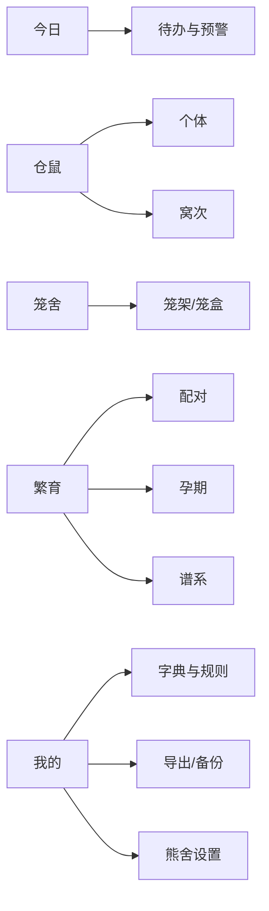

# 宠舍管家 → 熊舍管家功能转换表

> 项目名称：熊舍管家  
> 本轮目标：把“宠舍管家”静态逆向得到的功能骨架，转换为面向仓鼠饲养与专业繁育的产品范围。  
> 证据来源：本地 `Cattery Manager 2.15.0` 应用包、两份 2026-07-14 逆向报告、公开管理端与编辑器前端资源。

关联产出：

1. `/Users/snowchan27/Documents/scolvpet/docs/01-宠舍管家页面与业务流程逆向图.md`
2. `/Users/snowchan27/Documents/scolvpet/docs/02-繁育窝仔与分笼状态机.md`
3. `/Users/snowchan27/Documents/scolvpet/docs/03-核心实体关系与字段字典.md`

## 1. 证据口径

本文使用以下标记：

- **已验证**：可由 AOT package 路径、页面类、Service、Entity、API 路由或公开前端直接证明。
- **产品推导**：根据已验证模块推导其业务用途，但尚未取得完整运行态字段或状态转换。
- **熊舍设计**：为熊舍管家重新定义的能力，不代表原应用已经实现。
- **待确认**：需要应用成功运行、测试账号操作或更深层 AOT 调用关系分析才能确定。

静态证据统计：

| 证据 | 数量 |
|---|---:|
| Flutter package 路径 | 2,111 |
| 页面源码路径 | 205 |
| Controller 路径 | 32 |
| data Service 路径 | 66 |
| domain Entity 路径 | 87 |
| App AOT API 路由字符串 | 250 |
| 公开 Web 前端 API 路由字符串 | 231 |

## 2. 转换原则

1. 保留宠舍管家的“档案—事件—繁育—经营”业务骨架。
2. 重新设计仓鼠特有的短周期繁育、分笼、整窝管理和克级体重。
3. 首版服务专业熊舍，同时保持个人繁育者可以单人使用。
4. MVP 优先解决记录准确、提醒及时、谱系可追溯和批量操作。
5. 店铺装修、积分、广告、艺术图等增长功能后置。
6. 原产品的页面名称、视觉资产、代码实现和猫咪规则不直接复用。

## 3. 总体功能转换矩阵

转换动作定义：

- **保留**：业务目标相同，只调整术语或少量字段。
- **重构**：保留业务意图，按仓鼠场景重新设计流程与数据。
- **后置**：进入 P1/P2，不进入首版。
- **移除**：与熊舍管家核心价值关联较弱。

### 3.1 账号、组织与工作台

| 宠舍管家能力 | 证据 | 转换动作 | 熊舍管家定义 | 阶段 |
|---|---|---|---|---|
| 登录、验证码、Apple 登录 | `auth` 页面与 `auth_api_service` | 保留 | 手机验证码为主，第三方登录按发布端补充 | MVP |
| 商户/组织切换 | `merchant_info`、`organization`、`merchant_api_service` | 重构 | 一个账号可加入多个熊舍；个人用户默认拥有个人熊舍 | P1 |
| 首页概览 | `overview`、`analytics`、`main_page` | 重构 | 今日待办、在养数量、孕期母鼠、待分笼窝次、异常体重、空闲笼盒 | MVP |
| 首页模块装修 | `overview_module_customization_page`、theme API | 后置 | 仅支持快捷入口排序，不做完整装修系统 | P1 |
| 成员管理与邀请 | `member_management`、`member_invite` | 保留 | 舍主、繁育员、饲养员、客服、只读访客 | P1 |
| 等级与角色 | `member_level`、`level_api_service` | 重构 | 使用标准 RBAC，业务等级与权限分离 | P1 |

### 3.2 仓鼠个体档案

| 宠舍管家能力 | 证据 | 转换动作 | 熊舍管家定义 | 阶段 |
|---|---|---|---|---|
| 猫只档案 | `cat.dart`、`cat_detail_page`、`cat_api_service` | 重构 | 仓鼠编号、昵称、物种、品系、性别、生日、来源、状态、主图 | MVP |
| 品种管理 | `cat_variety`、`breed_management_page` | 重构 | 物种、品系、毛色、花纹、毛型、耳型等分层字典 | MVP |
| 标签、等级、排序 | tag/level/sort Entity 与 API | 保留 | 留种、观察、待交付、宠物级、繁育级等可配置标签；支持笼架顺序 | MVP |
| 照片与成长记录 | `cat/record`、DAM、云相册 | 保留 | 个体时间轴，关联照片、视频、体重、健康、繁育与交付事件 | MVP |
| 猫脸特征 | `cat_face_feature_api_service` | 移除 | 首版使用编号、照片与笼盒二维码识别 | — |
| 宠物转移 | `pet_transfer_api_service`、transfer 页面 | 重构 | 交付后可转移档案所有权，保留原熊舍与谱系来源 | P1 |

### 3.3 笼盒与环境

| 宠舍管家能力 | 证据 | 转换动作 | 熊舍管家定义 | 阶段 |
|---|---|---|---|---|
| 门店门禁/笼位 | `door_info`、door 页面与 API | 重构 | 笼架—层位—笼盒三级资源模型 | MVP |
| 寄养入住 | boarding 页面与 Service | 重构 | 转化为笼盒入住、移笼、临时配对、隔离记录 | MVP |
| 排队 | queue 页面与 API | 移除 | 对首版饲养繁育无直接价值 | — |
| 美容 | grooming 页面与 API | 移除 | 仓鼠不存在对应高频经营链路 | — |
| 笼位规则 | door rule API | 重构 | 单住/临时合笼/母带崽/隔离等占用规则 | MVP |
| 硬件接入 | 蓝牙秤与相关 Framework | 后置 | 首版手工快速称重；后续接入秤和温湿度传感器 | P2 |

熊舍特有笼盒状态：

```text
空置 → 已分配 → 在住
              ├→ 临时配对 → 分笼/恢复在住
              ├→ 孕期观察 → 母带崽 → 断奶清空
              ├→ 隔离观察 → 恢复/转笼
              └→ 待清洁 → 已清洁 → 空置
```

### 3.4 配对、繁育与窝仔

| 宠舍管家能力 | 证据 | 转换动作 | 熊舍管家定义 | 阶段 |
|---|---|---|---|---|
| 发情周期 | `estrus_cycle`、`estrus_api_service` | 重构 | 配对适宜窗口和观察记录；规则按物种配置 | MVP |
| 繁育计划 | `breeding_plan*` Entity、页面与 API | 保留并重构 | 选择父母、计划日期、目标性状、风险检查、执行状态 | MVP |
| 配种日志 | `mating_log`、stud service 页面 | 重构 | 临时合笼时间、观察结果、冲突情况、交配记录、分笼时间 | MVP |
| 生产确认 | `confirm_production_request`、`planes/confirm` | 重构 | 产仔日期、出生数、存活数、母鼠状态、窝次编号 | MVP |
| 窝仔管理 | `litter_management_controller`、`offspring_wall` | 深度重构 | 出生早期按窝管理，识别后批量生成个体档案 | MVP |
| 种公服务与邀请 | `stud_service`、breeding transaction | 后置 | 熊舍间借配、协作和履约记录 | P2 |
| 跨舍繁育交易 | breeding transaction API | 后置 | 仅在平台网络形成后开放 | P2 |

熊舍管家核心变化：

- 配对后必须产生“分笼截止时间”。
- 孕期与预产窗口由物种规则计算，并允许人工修正。
- 出生初期以 `Litter/窝次` 为记录主体，不强制立即建立每只幼崽档案。
- 断奶时支持批量辨别性别、批量分笼和批量建档。
- 父母、窝次、幼崽档案之间保持不可丢失的谱系关系。

### 3.5 健康、体重与日常护理

| 宠舍管家能力 | 证据 | 转换动作 | 熊舍管家定义 | 阶段 |
|---|---|---|---|---|
| 体重记录 | `cat_weight`、`cat_with_weight`、weight 页面/API | 重构 | 单位默认克；连续快速录入；支持个体与整窝均值 | MVP |
| 体重提醒 | `weight_alert_api_service`、设置页面 | 重构 | 绝对阈值、日变化率、周变化率、幼崽成长偏离 | MVP |
| 健康记录 | `health_records`、health 页面/API | 重构 | 牙齿、颊囊、眼鼻、皮毛、呼吸、步态、排泄、伤口 | MVP |
| 日常健康状态 | `daily_health_status` | 保留 | 食欲、饮水、活动、排泄、精神、异常备注 | MVP |
| 疫苗/驱虫 | 现报告确认健康提醒 | 重构 | 转为用药、复查、隔离、清洁消毒和必要护理 | MVP |
| 洗护 | 原猫只健康模块 | 移除 | 以笼盒清洁和环境维护替代 | — |

### 3.6 日历、提醒与 Widget

| 宠舍管家能力 | 证据 | 转换动作 | 熊舍管家定义 | 阶段 |
|---|---|---|---|---|
| 日历月视图 | calendar 页面与 Service | 保留 | 聚合繁育、健康、笼盒、交付和经营事件 | MVP |
| 事件提醒 | `event_reminder`、todo service | 保留并重构 | 模板化、相对日期、重复、延期、完成、取消 | MVP |
| Widget | App Group、`widget_breeding_plans`、`widget_todo_events` | 后置 | 今日待办、预产、待分笼、异常体重 | P1 |
| 推送 | 友盟、local notifications | 重构 | 首版以本地通知为基础，服务端推送用于多人协作 | MVP/P1 |

建议首版自动事件：

1. 配对观察结束；
2. 配对后分笼截止；
3. 孕期检查；
4. 预产窗口开始；
5. 窝仔日龄检查；
6. 开眼观察；
7. 断奶；
8. 分性；
9. 分笼；
10. 个体称重；
11. 笼盒局部/全面清洁；
12. 用药与复查；
13. 幼崽交付与回访。

### 3.7 谱系、遗传与配对建议

| 宠舍管家能力 | 证据 | 转换动作 | 熊舍管家定义 | 阶段 |
|---|---|---|---|---|
| 血统树 | `pedigree_tree` Entity 与页面 | 保留 | 多代祖先、父母与同窝关系 | MVP |
| 遗传档案 | `genetic.dart`、genetic API | 重构 | 表型、推测基因型、已验证基因型、置信度 | P1 |
| 配对模拟 | `breeding_simulator_page`、simulate API | 重构 | 输出可能毛色/花纹组合及解释 | P1 |
| 后代建议 | genetic suggest/AI | 后置 | 数据与规则稳定后再生成自然语言建议 | P2 |
| 近亲提示 | 产品推导 | 新增 | 展示共同祖先、亲缘层级和规则命中原因 | MVP |

### 3.8 客户、预订、交付与经营

| 宠舍管家能力 | 证据 | 转换动作 | 熊舍管家定义 | 阶段 |
|---|---|---|---|---|
| 客户/成员 | user/member Entity 与 API | 重构 | 意向人、预订人、领养人、合作熊舍联系人 | P1 |
| 心愿单 | wish 页面与 Service | 重构 | 幼崽意向、品系/性别/毛色偏好 | P1 |
| 商品与订单 | goods/product/order API | 重构 | 幼崽预订、订金、尾款、用品选配；保持合规的交接记录 | P1 |
| 合同 | contract 页面与 API | 保留 | 交接协议、健康说明、饲养须知、回访约定 | P1 |
| 收据 | receipt 页面与 API | 保留 | 订金、尾款及用品收据 | P1 |
| 转移二维码 | QR scan、transfer API | 保留并重构 | 扫码接收档案；二维码只携带短期随机码 | P1 |
| 寄养/美容订单 | boarding/grooming | 移除 | 不进入核心经营模型 | — |

### 3.9 财务、库存与报表

| 宠舍管家能力 | 证据 | 转换动作 | 熊舍管家定义 | 阶段 |
|---|---|---|---|---|
| 收支记录 | accounting Service、financial 页面 | 保留 | 收入、粮食、垫料、设备、医疗、物流等分类 | P1 |
| 日报/月报 | accounting report API | 保留 | 熊舍经营趋势与成本结构 | P1 |
| 商品销售报表 | goods-sales-report | 后置 | 用品或交付业务形成后开放 | P2 |
| 钱包/余额审批 | wallet、balance approval | 移除/后置 | 首版使用普通收支记录 | —/P2 |
| 库存 | 原产品商品/经营能力推导 | 新增 | 粮食、垫料、药品、耗材的批次、余量、有效期 | P1 |
| 单笼成本 | 熊舍设计 | 新增 | 按笼盒、个体或窝次归集饲养成本 | P1 |

### 3.10 内容、增长与平台工具

| 宠舍管家能力 | 证据 | 转换动作 | 熊舍管家定义 | 阶段 |
|---|---|---|---|---|
| 微信小程序管理 | 多个 miniprogram 页面/API | 后置 | 公开档案、在售/待交付信息和内容展示 | P2 |
| 店铺模板与装修 | shop/theme/editor | 后置 | 模板化公开主页，不做复杂编辑器 | P2 |
| SEO、文章与营销 | seo/article/marketing API | 后置 | 品系科普和熊舍内容运营 | P2 |
| 宠物艺术图 | art gallery WebView | 移除 | 与核心管理价值关联弱 | — |
| 前后对比视频、水印 | tools 页面 | 后置 | 作为内容传播工具评估 | P2 |
| 品牌任务、积分、宠豆 | brand task/point/pet bean | 移除 | 首版避免引入复杂增长系统 | — |
| AI 助手 | agent、ai Service | 后置 | 先建立结构化规则和可靠数据，再接入问答 | P2 |
| 备份与导出 | backup/export 页面/API | 保留 | CSV/JSON/PDF 与媒体清单；支持整舍迁移 | MVP/P1 |

## 4. 熊舍管家必须新增的核心模型

| 新模型 | 作用 | 首版关键字段 |
|---|---|---|
| `SpeciesRule` 物种规则 | 驱动繁育、体重和提醒默认值 | 物种、孕期范围、断奶日龄、分性日龄、分笼日龄、体重参考版本 |
| `Enclosure` 笼盒 | 管理空间、占用和环境 | 编号、位置、尺寸、状态、当前住鼠、清洁状态 |
| `EnclosureStay` 入住记录 | 保留移笼历史 | 笼盒、个体、入住/离开时间、用途、操作人 |
| `PairingSession` 配对会话 | 记录临时合笼及及时分笼 | 公鼠、母鼠、开始/结束、观察结果、冲突、分笼截止 |
| `Pregnancy` 孕期 | 独立记录预产范围及观察 | 母鼠、配对会话、推定日期、预产窗口、状态 |
| `Litter` 窝次 | 出生早期整窝管理 | 父母、出生日期、出生数、当前数、窝状态、所在笼盒 |
| `LitterCheck` 窝次检查 | 记录日龄节点与数量变化 | 窝次、日龄、存活数、窝均重、照片、备注 |
| `Phenotype` 表型 | 结构化描述外观 | 毛色、花纹、毛型、耳型、眼色、来源 |
| `GenotypeAssertion` 基因判断 | 区分推测与验证 | 基因位点、结果、证据类型、置信度、记录人 |
| `CareTask` 护理任务 | 统一繁育、健康与清洁提醒 | 类型、关联对象、计划时间、重复规则、状态 |
| `EnvironmentReading` 环境记录 | 关联温湿度与笼盒 | 笼盒、时间、温度、湿度、来源 |
| `Handover` 交付 | 管理预订到档案转移 | 个体、客户、订金、交付日、协议、回访计划 |

## 5. MVP 功能边界

### 5.1 MVP 必做

1. 账号与个人熊舍；
2. 仓鼠个体档案与批量建档；
3. 笼架/笼盒管理与移笼历史；
4. 配对会话及分笼提醒；
5. 孕期、产仔、窝次和批量拆分个体；
6. 克级体重与成长曲线；
7. 健康快捷记录；
8. 日历、待办与本地通知；
9. 父母关系、基础谱系和近亲提示；
10. 数据导出与基础备份。

### 5.2 P1

1. 多成员与角色权限；
2. 遗传档案与配对模拟；
3. 客户、预订、交付和档案转移；
4. 合同、收据、财务与库存；
5. Widget、多人推送、自动备份；
6. 环境记录和耗材计划。

### 5.3 P2

1. 公开主页、小程序与内容运营；
2. 熊舍间协作与借配；
3. 蓝牙秤、温湿度传感器；
4. AI 助手与自然语言遗传解释；
5. 内容传播工具。

## 6. 建议首版导航



## 7. 转换后的成功标准

熊舍管家 MVP 应能够让用户完成以下闭环：

1. 建立父母档案并分配笼盒；
2. 创建配对会话，记录观察并按时分笼；
3. 自动计算孕期观察和预产窗口；
4. 产仔后先建立窝次并按日龄记录；
5. 到期完成断奶、分性、分笼及批量个体建档；
6. 自动继承父母、生日、窝次和基础谱系；
7. 对每只仓鼠持续记录体重、健康和笼盒变化；
8. 通过日历和待办准确看到下一项操作；
9. 导出完整个体、窝次与谱系数据。

## 8. 当前结论

- **已验证：** 宠舍管家拥有覆盖档案、繁育、健康、日历、谱系、经营、会员和平台工具的完整业务骨架。
- **已验证：** 本地 AOT 中存在 205 个页面路径、66 个 Service、87 个 Entity 和 250 条 API 路由字符串；公开前端补充了带参数结构的管理接口。
- **产品推导：** 原产品适合参考其模块分层、事件模型、组织经营模型和商业化包装。
- **熊舍设计：** 短周期繁育、及时分笼、整窝管理、克级体重、笼盒资源和物种规则是熊舍管家的核心差异。
- **待确认：** 原产品的具体表单字段、状态枚举、提醒提前量、会员拦截点和角色权限仍需要更深静态还原或运行态核验。
