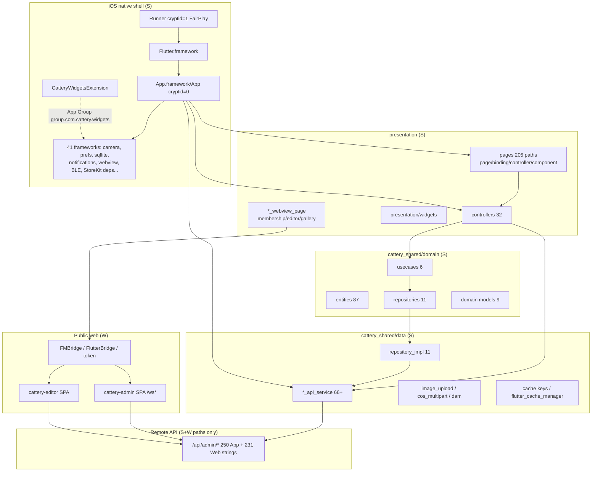
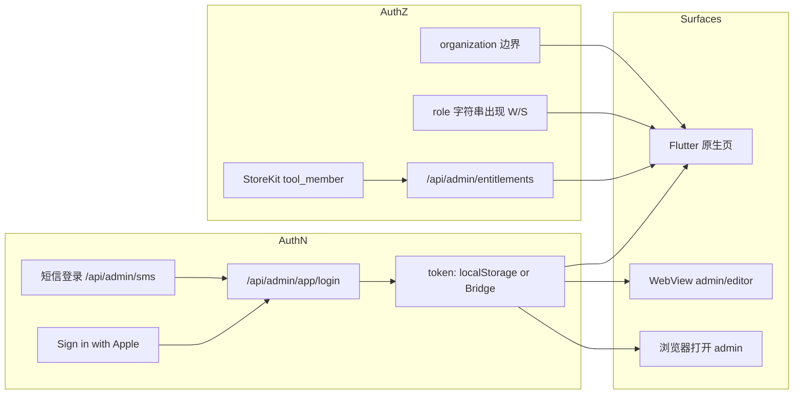

# 12 · 宠舍管家技术架构与运行时逆向

> 目标软件：宠舍管家 / Cattery Manager `2.15.0 (73)`  
> 波次：**R11**  
> 生成依据：R0–R3 / R9–R10 证据目录（S/W/D/B/I）  
> 约束：不把推断写成事实；运行态启动仍受 FairPlay 阻断（R3）

## 1. 结论摘要

| 层 | 技术选型 | 证据 |
|---|---|---|
| UI / 路由 / 状态 | Flutter + **GetX**（GetPage / GetxController / Bindings） | S：AOT package 路径、`GetMaterialApp` 字符串 |
| 领域 | `cattery_shared/domain`（entities / repositories / usecases / models） | S：AOT 分层路径统计 |
| 数据 | `cattery_shared/data`（`*_api_service`、repository_impl、upload/cache） | S |
| 原生壳 | iOS Runner（FairPlay cryptid=1）+ WidgetKit 扩展 | S：Mach-O / codesign |
| 业务 AOT | `App.framework/App` cryptid=0，约 24MB | S：SHA-256 `8bb590bb…` |
| 网络 | Dart HTTP API services；Web 侧 axios 风格 + 拦截器 | S + W |
| 存储 | SharedPreferences、sqflite、flutter_cache_manager | S：插件 + 通道 |
| 媒体 | 相机/相册/裁剪/视频压缩/上传 COS/DAM | S + W |
| 商业化 | StoreKit 工具会员 + KSAdSDK + entitlements API | S |
| 跨端 | WKWebView + FMBridge/FlutterBridge；公开 admin/editor SPA | S + W |
| 运行态 | 本分析机 **无法 spawn Runner**（FairPlay -42004） | D/B：R3 |

## 2. 应用层架构图

节点均可追溯到 `page/controller/service/entity` 目录、Framework 清单或 Web 证据。



### 2.1 分层职责（S）

| 层 | 路径前缀 | 职责 |
|---|---|---|
| App 配置/路由 | `cattery_flutter/app/{routes,navigation,bindings,config}` | 启动绑定、路由表 |
| 页面 | `presentation/pages/<module>/` | UI；含 colocated controller/binding |
| 全局 Controller | `presentation/controllers/` | 跨页状态（cats、breeding_plan、calendar…） |
| API Service | `data/services/*_api_service.dart` | HTTP 封装 |
| Domain Entity | `domain/entities/*` | 序列化模型（含 `.g.dart`） |
| Repository | `domain/repositories` + `data/repositories/*_impl` | 端口与实现 |
| WebView handlers | `core/webview/*_handler.dart` | JS bridge 动作分发 |
| 移动端媒体 | `cattery_mobile/data/services/*` | 压缩/缩略图等 |

关联边（名称 token 重合启发式）：`association-graph.csv` 1069 边 — **S 启发式，非运行时调用图**。

## 3. 领域 ER 图（逻辑）

字段名以 **Entity 路径 / API 模块** 为锚点；细粒度 JSON 字段在运行态补证前标 **B/I**。  
同名异义已在表后说明。

```mermaid
erDiagram
  USER ||--o{ ORGANIZATION : member_of
  USER ||--o| MEMBERSHIP : holds
  ORGANIZATION ||--o{ CAT : owns
  ORGANIZATION ||--o{ MERCHANT_INFO : operates
  CAT ||--o{ CAT_TAG : tagged
  CAT }o--|| CAT_VARIETY : breed
  CAT ||--o{ CAT_WEIGHT : weighed
  CAT ||--o{ EVENT_RECORD : has
  CAT ||--o{ HEALTH_RECORDS : has
  CAT ||--o{ ESTRUS_CYCLE : cycles
  CAT ||--o{ MATING_LOG : mates
  BREEDING_PLAN }o--|| CAT : sire_or_dam
  BREEDING_PLAN ||--o{ BREEDING_PLAN_REMINDER : reminds
  BREEDING_PLAN ||--o{ CONFIRM_PRODUCTION_REQUEST : confirms
  BREEDING_PLAN ||--o{ CAT_WEIGHT : litter_weights
  PEDIGREE_TREE }o--|| CAT : roots
  EVENT_RECORD ||--o{ EVENT_REMINDER : schedules
  EVENT_RECORD ||--o{ RECORD_COMMENT : comments
  QUEUE_INFO }o--o| CAT : optional_pet
  DOOR_INFO }o--o| CAT : optional_pet
  WISH_REQUEST }o--o| CAT : desired
  CONTRACT_TEMPLATE ||--o{ /*instances*/ : generates
  RECEIPT_TEMPLATE ||--o{ /*instances*/ : generates
  SHOP_PAGE ||--o{ ARTICLE : publishes
  SHOP_PAGE ||--o{ TEMPLATE_INFO : uses
  MINI_PROGRAM_INFO ||--o| SHOP_PAGE : publishes
  MEMBER_INFO ||--o{ MEMBER_LEVEL : leveled
  PRODUCT_INFO ||--o{ /*orders*/ : sold
  AGENT_MESSAGE }o--|| USER : chats
  BACKUP_TASK }o--|| ORGANIZATION : backups
  GENETIC }o--|| CAT : genotype

  USER {
    string id
    string phone_or_apple B
  }
  ORGANIZATION {
    string id
    string name B
  }
  CAT {
    string id
    string name B
    string sex B
    date birthday B
    string status B
  }
  BREEDING_PLAN {
    string id
    int status_0_to_3 W
    date breeding_date B
  }
  CONFIRM_PRODUCTION_REQUEST {
    string plane_id B
    array offspring B
  }
  MEMBERSHIP {
    string product_id S
    string entitlement B
  }
  SHOP_PAGE {
    string id B
    string seo B
  }
  MINI_PROGRAM_INFO {
    string appid B
    string version B
    string audit_state B
  }
```

### 3.1 状态与枚举（已验证片段）

| 枚举 | 值 | 等级 |
|---|---|---|
| 繁育四级 | 0 待搭配 / 1 待生产 / 2 带娃中 / 3 已归档 | **W**（admin 明文）+ S（planes API） |
| StoreKit 产品 | `com.cattery.tool_member.{1month,1year,3year}` | **S** |
| 桥接环境 | `app` vs `browser` | **W** |

### 3.2 同名 / 近义消歧

| 名称 | 含义 A | 含义 B | 处理 |
|---|---|---|---|
| `planes` / `plane` | 繁育计划（breeding plan）API 路径 | 非几何“平面” | 统一映射 `breeding_plan` entity |
| `member` / `membership` | 顾客会员等级 | 工具会员/权益 entitlements | 分 `member_*` vs `membership`/`entitlements` |
| `door` | 上门服务单 | 非物理门禁 | `door_info` + door API |
| `knife` | 业务模块名（AOT/API 存在） | 语义待产品确认 | **B/I**：保留模块名，不臆造中文业务 |
| `record` | 日常/事件记录 | 健康记录 | 分 `event_record` vs `health_records` |
| `tag` / `cat_tag` / `rating_tag` | 猫标签 vs 评分标签 | — | 分实体保留 |
| `template` | 店铺/合同/回执/小程序模板 | 编辑器素材 | API 前缀区分 shop/contract/receipt/weixin |

ER 节点与 `entity-catalog.csv` / `api-catalog.csv` 模块前缀交叉；无实体支撑的“订单实例”等仅以注释 `/*instances*/` 标出（运行态 B）。

## 4. 缓存、离线、同步、媒体、通知

| 能力 | 机制 | 等级 | 证据 |
|---|---|---|---|
| 键值偏好 | SharedPreferences / Foundation prefs 通道 | S | 插件 + MethodChannel |
| 本地 DB | sqflite（`com.tekartik.sqflite`） | S | Framework + 通道 |
| HTTP 缓存 | flutter_cache_manager | S | AOT package |
| 业务缓存键 | `intro_splash_config_cache_v3`、`app_tool_badges_cache_time`、`cache_` 前缀 | S | config-markers |
| 离线首页 | App Store 2.15 文案称离线/未登录可展示首页 | P | release-history |
| 会话同步 | WebView 与 App 共享 Bridge token | W | R9 拦截器 |
| 多端数据 | 以服务端 `/api/admin` 为源；冲突策略 **B** | I/B | — |
| 图片/视频上传 | image_upload、cos_multipart、DAM、FormData | S+W | services + admin JS |
| 下载 | flutter_downloader | S | Framework |
| 本地通知 | flutter_local_notifications | S | Framework + channel |
| 推送 | 友盟等线索见静态报告；本轮未抓包 | I/B | LA1 静态报告 |
| Widget | WidgetKit 扩展 + App Group | S | appex + entitlements 报告 |
| 蓝牙秤 | flutter_blue_plus + 权限文案 | S | Framework + Info.plist |
| 错误恢复 | 启动失败在 spawn 前（非 Flutter 区） | D | R3 FairPlay |
| 任务队列 | 客户端 outbox 未证实；backup_task entity 存在 | I/B | entity 名 |

## 5. 安全与权限边界



| 主题 | 结论 | 等级 |
|---|---|---|
| 令牌存储（Web） | `localStorage.token` | W |
| 令牌存储（App） | Bridge 下发；Keychain/具体键名 **B** | W + B |
| 令牌刷新/过期 UI | 未运行观察 | B |
| 传输 | HTTPS 公网 API；ATS 允许 arbitrary loads（Info.plist） | S — 安全风险点 |
| 签名 | Apple iPhone OS Application Signing；Team `W9DZU4H693` | S |
| 调试 | 无 get-task-allow；Runner FairPlay | S |
| 权限弹窗文案 | 相机/相册/蓝牙/麦克风/定位/跟踪 | S：Info.plist |
| 会员门禁 | entitlements API + IAP 产品 + membership WebView | S+W |
| 日志脱敏 | 分析证据已禁 Token；生产 App 日志策略 **B** | 流程约束 |
| Web 权限 | admin 路由守卫依赖登录态；细粒度 RBAC **B/I** | W |

## 6. 运行时边界（R3）

```text
open(Cattery Manager)
  → runningboardd job
  → launchd xpcproxy
  → kernel fairplayOpen -42004
  → EXEC_EXIT_REASON_FAIRPLAY_DECRYPT
  → open 返回 -10671
  → Flutter 代码路径执行次数 = 0
```

影响：R11 架构以 **静态 + Web** 为主；“运行时策略”中凡依赖真机行为的条目保持 **B**，并指向 `runtime/r3/launch-block-report.md` 补证条件。

## 7. 证据覆盖率

| 目录/主题 | 条目 | 覆盖 | 说明 |
|---|---|---|---|
| 页面路径 | 205 | 100% 入库 | 职责/关联状态 S；真实 UI D 受阻 |
| Controller | 32 | 100% | 同上 |
| Service | 66 | 100% | 同上 |
| Entity | 87 | 100% | 字段级 JSON B |
| App API | 250 | 100% 分析状态 | method 部分 I/未知 |
| Web API | 231 | 100% | method 228 W |
| 插件/Framework | 41+ | 100% 盘点 | R2 |
| 通道/Bridge | 76+20 | 有目录 | R2/R9 |
| 启动动态 | 4 场景 | 记录为 B | R3 |
| P0 API 字段 | 94 | 骨架 + 逐条 B | R10 |

机器可读快照：`reverse-evidence/full/runtime/r11-coverage.json`。

## 8. 已验证 vs 推断

| 类型 | 内容 |
|---|---|
| **已验证 S/W/D** | 分层包结构、插件集、StoreKit 产品 ID、繁育状态中文枚举、Web 鉴权拦截器、FairPlay 阻断链、API 路径全集、Bridge 名称 |
| **高可信 I** | page→service 名称关联、App-only method 启发式、组织/角色存在但矩阵不全、推送厂商细节 |
| **受阻 B** | 真机页面字段、请求/响应体、令牌生命周期、冲突同步、乐观锁、错误码表、权限矩阵逐动作 |

## 9. 与熊舍实现的架构启示（预告 R12）

1. **保持清晰分层**：presentation / domain / data 与 OpenAPI 生成客户端对齐（熊舍已有 generated dart client 方向）。  
2. **繁育状态机**应一等公民建模（枚举 + 守卫 API），勿仅 UI 状态。  
3. **WebView 平台能力**（装修/小程序）可后置；Bridge 契约需版本化。  
4. **会员/权益**与核心档案解耦（entitlements 门面）。  
5. **仓鼠化**时替换 cat/planes 语义为 enclosure/litter 短周期模型（R12 展开）。

## 10. 文件索引

| 文件 | 用途 |
|---|---|
| `reverse-evidence/full/runtime/static-architecture.json` | R2 Mach-O/插件摘要 |
| `reverse-evidence/full/runtime/association-overview.md` | 静态关联概览 |
| `reverse-evidence/full/runtime/r3/` | 启动阻断 |
| `reverse-evidence/full/web/r9-report.md` | Web 平台 |
| `docs/11-…API…md` | API 契约 |
| `reverse-evidence/full/runtime/r11-coverage.json` | 本波覆盖率 |
| `reverse-evidence/full/runtime/r11-er-nodes.csv` | ER 节点 ↔ entity 追溯 |

## 11. 敏感信息

本文不包含 Token、手机号、用户业务数据；设备 UDID 已在 R3 脱敏。
