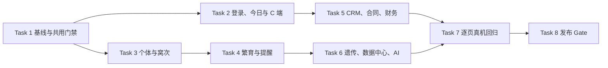

# 小程序全功能迭代 Implementation Plan

> **For agentic workers:** REQUIRED SUB-SKILL: Use superpowers:subagent-driven-development (recommended) or superpowers:executing-plans to implement this plan task-by-task. Steps use checkbox (`- [ ]`) syntax for tracking.

**Goal:** 对 `apps/miniprogram-next` 已声明的 37 个页面入口完成一次可追溯的功能、权限、契约、体验与真机验收迭代，并保留 C 端兼容能力。

**Architecture:** 本轮不新建平行业务层或手写 HTTP 契约。B 端继续使用 `generated/ts/scolvpet-api` 加 `src/api` adapter，C 端原生混写仅维护既有 7 页与深链兼容；每个页面按同一验收卡执行，写操作保留幂等键、需要并发保护的端点按 OpenAPI 传递 `If-Match`。

**Tech Stack:** Taro 4.2.1、React 18、TypeScript、微信小程序/Skyline、Vitest、Node test、OpenAPI TypeScript client、`@scolvpet/mp-ui`。

---

## 0. 审查结论（2026-07-31，本地静态基线）

### 0.1 范围清点

`src/app.config.ts` 共声明 **37 个页面入口**：B 端主包 2 页、B 端 10 个分包 28 页、C 端原生混写 7 页。所有入口均已写入路由；本轮“全功能迭代”的完成标准不是“页面能打开”，而是每页都完成本计划第 1 节的验收卡。

| 范围 | 页数 | 当前状态 | 审查结论 |
| --- | ---: | --- | --- |
| B 端登录与今日工作台 | 2 | 已写入 | 已有会话、权限和任务动作；需补静态页级回归与真机体验证据。 |
| B 端经营分包 | 28 | 已写入 | 真实 API、写操作与大部分错误/空态均已接入；类型边界、全页测试和真实账号路径仍未完成全覆盖。 |
| C 端公开/交易兼容页 | 7 | 已写入 | 原生回归 22/22 通过；仍需客户双机真机走通公开浏览至合同的闭环。 |
| 小程序正式发布配套 | 不计页数 | 待确认 | 正式 AppID、合法域名、订阅模板、真实短信/微信通道和真机账号均在工程外。 |

### 0.2 已验证的门禁

在停止写入后顺序运行，结果如下：

| 命令 | 结果 |
| --- | --- |
| `npx tsc --noEmit` | 已验证：通过。 |
| `npm test` | 已验证：14 个测试文件、60 通过、1 跳过。跳过项为预览类测试，不得在发布验收中当作已验证。 |
| `npm run test:native` | 已验证：22/22 通过。 |
| `npm run lint` | 已验证：退出码 0，但有 124 条 `no-explicit-any` 警告。 |

未在本次审查中重跑 `make miniprogram-next-build` 与 `make release-miniprogram-next`：两者会重写本地 `dist/`，而工作树存在其他并行修改。它们列为 Task 8 的静止工作树门禁，当前状态为待确认。

### 0.3 主要缺口与优先级

| 优先级 | 发现 | 证据 | 本计划处置 |
| --- | --- | --- | --- |
| P0 | 全量功能无真实设备闭环证据，不能把“已写入”升级为“已验证”。 | `apps/miniprogram-next/README.md` 的真机 Gate 全部未勾选。 | Task 2–8 每批完成后在真机证据表记录 B 端、C 端与低端机结果。 |
| P0 | 任何并行写入期间运行的测试都不是稳定基线。 | 本次首次 Vitest 读取到 SHA-256 常量修正的中间版本；静止后重跑 60/60 通过。 | Task 1 先固定基线与结果记录，所有 Gate 在工作树静止后顺序执行。 |
| P1 | 37 个页面没有一对一的功能验收清单和自动化测试映射。 | 现有测试集中于入口、adapter、权限和少数合同/财务场景。 | Task 1 建立页面覆盖矩阵；Task 2–7 每页至少补一条关键路径回归。 |
| P1 | 124 条 `any` 绕过生成契约类型，集中于个体、数据中心、遗传、合同、CRM 等页面。 | `npm run lint` 输出。 | Task 1 先收紧 lint 预算；各领域任务用生成类型、语义 extension 或局部 type guard 逐页消除新增与修改处的 `any`。 |
| P1 | Vitest 的 Taro DOM 桩会输出 React 属性警告。 | `tests/stubs/taro-components.tsx` 使 `scrollY`、`refresherEnabled` 等透传到 DOM。 | Task 1 修正桩的属性过滤，使警告成为可观察的失败信号而非噪声。 |
| P1 | 预签上传和下载依赖微信后台登记的对象存储域名。 | `README.md` 的 `uploadFile`/`downloadFile` 合法域名说明。 | Task 8 按正式 API 返回值核对并登记域名，再作实体头像和数据中心真机上传/下载。 |
| P2 | 已核到的直接 `Taro.request` 仅用于预签二进制上传，原生 C 端 `utils/api.js` 仅服务兼容页。 | `animals/detail`、`data-center/actions`、`utils/api.js`。 | 保留例外；Task 1 增加静态断言，禁止 B 端业务再新增直接 HTTP。 |

## 1. 每页统一验收卡（所有 Task 2–7 必须逐页填写）

每一个声明路由都必须留下下列七项结果；任一项失败，页面不能标记“已验证”。

1. **进入与返回**：首页入口、页面参数、深链、登录失效后的回跳均可重复执行。
2. **数据契约**：B 端只使用生成客户端；响应字段为生成类型、语义 extension 或局部 guard，不在 app 侧复制 endpoint/JSON 契约。
3. **权限与会话**：无会话、无能力、会话刷新和 401/403 分别有确定行为；只读能力不能触发写动作。
4. **写入安全**：每个写操作有一次性幂等意图；OpenAPI 要求版本的更新/重试操作传递 `If-Match`，冲突后提示刷新而非静默覆盖。
5. **状态完整性**：加载、空数据、业务错误、断网/离线快照（适用时）、提交中与提交成功后刷新均可见且可恢复。
6. **交互与视觉**：使用 `@scolvpet/mp-ui` tokens；Skyline 页验证滚动、手势返回和按压态，不达标页记录原因并回退 WebView。
7. **回归证据**：新增或扩展该页面的 Vitest/Node 测试；真机页记录设备、微信版本、账号角色、请求结果和截图/录屏位置。

## 2. 执行顺序与依赖

Task 2–6 可按不重叠文件域并行，但每个任务都必须在合并前运行自己的测试；Task 7 和 Task 8 必须串行，且不得与功能写入并发。

### Task 1：固定基线、覆盖矩阵与跨域质量门禁

**文件：**
- 新建：`apps/miniprogram-next/tests/feature-iteration-matrix.test.ts`
- 修改：`apps/miniprogram-next/tests/stubs/taro-components.tsx`
- 修改：`apps/miniprogram-next/.eslintrc.cjs`
- 修改：`apps/miniprogram-next/tests/migration-surface.test.ts`
- 新建：`docs/evidence/miniprogram-full-iteration/README.md`

- [x] 把 37 条 `app.config.ts` 路由写入 `feature-iteration-matrix.test.ts`，每条包含 `route`、`domain`、`criticalFlow`、`testFile`、`deviceEvidence` 五个非空字段；测试断言矩阵路由集合与 `app.config.ts` 完全相等。
- [x] 在 `migration-surface.test.ts` 断言 B 端业务页不得新增 `Taro.request`/`wx.request`；白名单仅为 `src/api/taro-fetch.ts` 与两个预签二进制上传调用点。C 端兼容页 `src/utils/api.js` 不计入 B 端扫描。
- [x] 让 Taro DOM 桩只转发 DOM 支持的属性，消费 `scrollY`、`bounces`、`enhanced`、`showScrollbar`、`refresher*`、`placeholderStyle`、`confirmType` 与 `onConfirm`，使 `npm test` 无 React 属性警告。
- [x] 将 `no-explicit-any` 设为“本轮不允许新增”的 lint 基线：先记录 124 条存量，再为本轮修改页面逐个减少；不得用全局 disable 掩盖。
- [x] 在 `docs/evidence/miniprogram-full-iteration/README.md` 建立真机记录模板：日期、提交、设备、微信版本、账号角色、入口、网络、结果、截图/录屏路径、回归人。
- [x] 运行 `npx tsc --noEmit && npm test && npm run test:native && npm run lint`；预期 TypeScript 与测试全绿，lint 无 error 且警告数不高于冻结基线。

### Task 2：登录、今日工作台与 C 端公开交易链

**页面：**

| 域 | 路由 | 关键路径 |
| --- | --- | --- |
| B 登录 | `pages/login/index` | `wx.login`、已绑定会话复用、手机号验证码绑定、过期票据、生产禁用开发一键登录。 |
| B 今日 | `pages/today/index` | 今日队列读取、完成/延期动作、刷新、无权限和登录过期引导。 |
| C 入口 | `pages/index/index` | 扫码/输入 slug、缓存与深链覆盖。 |
| C 目录 | `pages/catalog/catalog` | 已发布个体列表、媒体与空目录。 |
| C 详情 | `pages/detail/detail` | 个体详情、预订提交、重复点击与错误恢复。 |
| C 血统 | `pages/pedigree/pedigree` | 三代显示、缺边空位与公开限制。 |
| C 模拟 | `pages/simulate/simulate` | 模拟参数、结果和失败提示。 |
| C 我的预订 | `pages/my-reservations/my-reservations` | 客户身份、网络失败保留会话、401 清理会话。 |
| C 合同 | `pages/contract/contract` | token 只读、过期/无效 token 提示。 |

- [ ] 为 B 登录补已绑定、需绑定、票据过期、服务端无 `currentOrganization` 四个测试场景，并验证会话保存和登出后 API token 同步清理。
- [ ] 为今日页补完成、延期、刷新失败、只读角色四个测试场景；每个写操作断言请求携带幂等键。
- [x] 移除今日页“顺延到明天”伪操作：OpenAPI 未声明延期端点时，面板仅保留真实调用 `cancelTask` 的“跳过一次”。
- [ ] 为 C 端 7 页分别新增一个关键路径断言；保留既有原生 22 条测试，并在同一测试中覆盖 401 与非 401 网络错误的不同会话行为。
- [ ] 用 owner、viewer、未登录三种身份跑 B 登录/今日页；用客户 A、客户 B 两台设备跑 C 端“浏览 → 预订 → 我的预订 → 合同”链路。
- [ ] 运行 `npm test -- --run tests/pages.test.tsx tests/app-glue.test.ts`、`npm run test:native`，并把双机证据写入 Task 1 的 evidence 目录。

### Task 3：个体档案与窝次闭环

**页面：**

| 域 | 路由 | 关键路径 |
| --- | --- | --- |
| 个体 | `packages/animals/index/index` | 检索、空态、进入详情、写权限入口。 |
| 个体 | `packages/animals/detail/index` | 资料编辑、体重、健康、头像预签上传/移除、离线快照、并发冲突。 |
| 个体 | `packages/animals/create/index` | 必填字段、表型目录与单个创建。 |
| 个体 | `packages/animals/batch-create/index` | 批次校验、原子提交、重复点击。 |
| 窝次 | `packages/litters/index/index` | 列表、空态、进入详情。 |
| 窝次 | `packages/litters/detail/index` | 数量调整、性别分笼、个体化、断奶与版本冲突。 |

- [ ] 使用生成的 `Hamster`、健康、体重、窝次类型或语义 extension 替换本任务改动处的 `any`；不新建 API 镜像 DTO。
- [ ] 为个体详情补预签上传成功、上传失败、取消选择、完成上传失败、移除头像、`If-Match` 冲突六个断言；SHA-256 对空串、`abc`、55/56/64 字节边界与真实文件 ArrayBuffer 均做已知向量校验。
- [ ] 为创建/批量创建补必填校验、重复点击复用同一幂等意图、服务端字段错误显示和成功后返回列表四个断言。
- [ ] 为窝次详情补数量事件、个体化、断奶、冲突刷新与无写权限五个断言。
- [ ] 在真实设备验证图片上传/下载合法域名、低网速取消、离线快照和 Skyline 手势返回；不满足时按页回退 WebView 并记录。

### Task 4：繁育计划、提醒与订阅消息

**页面：**

| 域 | 路由 | 关键路径 |
| --- | --- | --- |
| 繁育 | `packages/breeding/index/index` | 列表、空态、创建入口。 |
| 繁育 | `packages/breeding/create/index` | 配对、规则版本与创建。 |
| 繁育 | `packages/breeding/detail/index` | 状态推进、观察记录、出生/取消与冲突。 |
| 提醒 | `packages/reminders/index/index` | 列表、创建、日历入口。 |
| 提醒 | `packages/reminders/create/index` | 日期、频率、提交与失败恢复。 |
| 提醒 | `packages/reminders/calendar/index` | 日期聚合、筛选、跳转和订阅设置。 |
| 提醒 | `packages/reminders/subscriptions/index` | 服务端模板恢复、微信授权、拒绝/失败/重试。 |

- [ ] 为繁育创建与详情的每一种可见状态转换添加“合法状态成功、非法状态禁用、409 后刷新”的测试，所有状态写入复用单次用户意图的幂等键。
- [ ] 为提醒创建补过去日期、缺标题、网络失败、成功刷新；为日历补跨日聚合与无任务空态。
- [ ] 为订阅页补服务端模板缺失、用户拒绝、微信 API 失败、授权成功后服务端同步失败及重试；模板 ID 不得从本地缓存回填。
- [ ] 用真实测试号验证任务提醒授权、取消授权和再次授权；正式模板未配置时页面显示可操作说明，不能伪称订阅已生效。

### Task 5：CRM、合同/回执与财务交易链

**页面：**

| 域 | 路由 | 关键路径 |
| --- | --- | --- |
| CRM | `packages/crm/index/index` | 列表、筛选、创建入口。 |
| CRM | `packages/crm/create/index` | 客户创建、固定幂等意图、字段错误。 |
| CRM | `packages/crm/detail/index` | 预订、交付、确认/取消、权限与刷新。 |
| 合同 | `packages/contracts/index/index` | 合同/回执列表、创建与模板入口。 |
| 合同 | `packages/contracts/create/index` | CRM 关联、创建、签发、版本冲突。 |
| 合同 | `packages/contracts/detail/index` | 状态动作、PDF 下载/打开、重放与冲突。 |
| 合同 | `packages/contracts/templates/index` | 模板列表、创建、空态与权限。 |
| 财务 | `packages/finance/index/index` | 汇总、列表、分类与新增入口。 |
| 财务 | `packages/finance/create/index` | 收支金额、日期、分类、提交与重试。 |
| 财务 | `packages/finance/categories/index` | 分类创建、读写角色区别与刷新。 |

- [ ] 逐个核对 CRM、合同/回执、财务写端点的 OpenAPI 是否要求 `If-Match`；要求的端点补版本传递和 409 刷新，不要求的端点在测试中明确断言其契约不带版本头。
- [ ] 为 CRM 创建、预订、交付、确认、取消和完成交付分别覆盖重复点击；创建类页面使用 `createIdempotencyIntent`，不得每次点击生成新键。
- [ ] 为合同创建/签发/状态动作和模板创建覆盖关联项为空、关联项有效、版本冲突、权限拒绝与 PDF 下载失败；中文 PDF 以真实设备打开确认排版。
- [ ] 为财务创建和分类补金额边界、无分类、只读角色、重复提交和列表刷新测试；把本任务改动处的 `any` 改成生成类型或局部 guard。
- [ ] 以 owner 和 viewer 分别跑 CRM 到合同/回执再到财务的交叉链，记录不可写角色不出现操作入口且 API 不被调用。

### Task 6：遗传、数据中心与 AI 助手

**页面：**

| 域 | 路由 | 关键路径 |
| --- | --- | --- |
| 遗传 | `packages/genetic/index/index` | 档案/模拟列表与工作台入口。 |
| 遗传 | `packages/genetic/create/index` | 表型目录、档案创建、目标配对模拟、反馈和历史摘要。 |
| 数据 | `packages/data-center/index/index` | 汇总、入口权限和空态。 |
| 数据 | `packages/data-center/actions/index` | CSV 选择、预签上传、映射、预检、提交、逐行结果、错误报告、导出/备份、下载与重试。 |
| AI | `packages/ai/index/index` | 快捷问题、草案、确认/取消、清空与业务深链。 |

- [ ] 遗传页以生成类型承接表型目录、档案和模拟结果；测试覆盖空目录、目标配对、失败提示、历史摘要和从结果深链到个体/繁育页。
- [ ] 数据中心为每个阶段建立状态机测试：未选文件、上传、已建任务、已映射、预检失败、可提交、部分失败、导出/备份成功、下载失败、重试与版本冲突。上传仅允许预签 URL 例外，业务 API 仍经 `defaultApi`。
- [ ] 用已知 SHA-256 的小 CSV 与错误 CSV 真机验证导入；验证对象存储上传、错误报告下载、导出 ZIP 与备份文件的微信合法域名。
- [ ] AI 页测试快捷问题、草案字段预填、确认、取消、网络错误、会话过期与五种业务深链；确认/取消保持一次动作一个幂等意图。
- [ ] 以无 `write_genetic`、无 `write_import`、无 AI 确认权限的账号回归，保证按钮隐藏/禁用与服务端拒绝均被正确呈现。

### Task 7：37 页逐页真机回归与体验收口

**文件：**
- 修改：`docs/evidence/miniprogram-full-iteration/README.md`
- 新建：`docs/evidence/miniprogram-full-iteration/<日期>/route-matrix.md`
- 新建：`docs/evidence/miniprogram-full-iteration/<日期>/`

- [ ] 从 Task 1 的矩阵导出 37 行真机表；每一行填写验收卡七项、设备与账号，并附截图/录屏。未测试行保持“待确认”，不得用相邻页面结果代替。
- [ ] 在 iOS 和 Android 各验证一次 B 端入口、分包首次加载、登录失效、返回手势、下拉刷新、写入成功/失败；额外选择一台低端 Android 复核 Skyline。
- [ ] 在客户 A/B 双机验证 C 端从目录到预订、B 端 CRM 接收与状态变化、客户侧预订/合同更新的端到端一致性。
- [ ] 逐页核查 tokens、导航栏标题、大标题滚动、空态、错误态与按压态；不能满足 Skyline 的页面删除该页 `renderer: 'skyline'` 配置并写明原因。
- [ ] 将所有 37 行标记为“已验证”或“待确认”；若任何 P0 关键链为待确认，则出口保持待确认。

### Task 8：静止工作树发布 Gate 与外部配置验收

**文件：**
- 修改：`apps/miniprogram-next/README.md`
- 修改：`docs/34-ScolvPet-小程序全量迁移执行矩阵.md`
- 新建：`docs/evidence/miniprogram-full-iteration/<日期>/release-gate.md`

- [ ] 确认无并行写入后，顺序运行 `npx tsc --noEmit`、`npm test`、`npm run test:native`、`npm run lint`、`make miniprogram-next-test`、`make miniprogram-next-build`、`node tools/mp-dist-smoke.mjs apps/miniprogram-next/dist` 与 `make release-miniprogram-next`；记录命令、提交、退出码和页面/分包体积。
- [ ] 以正式 API 主机和正式 AppID 执行 release Gate；构建结束立即恢复开发默认配置，并用 `git diff -- apps/miniprogram-next/src/utils/config.js apps/miniprogram-next/project.config.json` 确认无生产值残留。
- [ ] 在微信公众平台登记 API、预签上传、下载 URL 的所有 origin；记录正式 AppID、订阅模板 ID、真实短信/微信 provider 配置的责任人和完成状态，但不得把凭据写入仓库或 evidence 文件。
- [ ] 用真实账号完成 B 端登录、任务订阅、头像上传、CSV 上传/下载、合同 PDF 打开和 C 端双机预订链；任何外部前置未完成均把发布状态写为“待确认”。
- [ ] 只有 Task 1–8 均满足且 37 行真机表无 P0 待确认时，才把 `docs/34` 的小程序出口改为“已验证”；否则保留“已写入 / 待确认”的真实状态。

## 3. 范围边界

- 不把 Flutter 专属的 IAP、WidgetKit、APNs 迁入小程序。
- 不新增笼舍管理、成员管理、增长获客的小程序入口；这符合 `docs/34` 的范围收敛。
- 不为新接口新增 `client.dio`、手写 JSON/path 契约或无语义 DTO；生成 OpenAPI 类型不足时先修改 `specs/api/openapi.yaml` 并重新生成客户端。
- 不删除 `apps/miniprogram/`，直到 C 端 7 页客户真机回归全部已验证。
- 不在本任务中提交或覆盖其他并行工作树的修改；每个领域任务只暂存其显式 pathspec。

## 4. 计划自检

- 覆盖：37 个路由均在 Task 2–6 的页面表中，所有页再由 Task 7 逐行验收。
- 契约：Task 1、3、5、6 明确禁止新增平行契约面，并为预签传输例外保留边界。
- 测试：每个领域都要求关键路径自动化回归；Task 7 真机，Task 8 构建/发布 Gate 分层验证。
- 外部依赖：正式 AppID、域名、订阅模板和真实通道被单独标为待确认，不会被源码测试掩盖。
