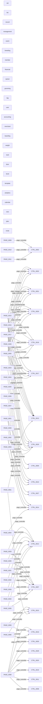

# 静态关联概览（R2）

证据等级：S（AOT 路径/名称 token 重合）。非运行时调用图。

```mermaid
flowchart LR
  cat[cat]
  list[list]
  record[record]
  management[management]
  event[event]
  breeding[breeding]
  member[member]
  financial[financial]
  queue[queue]
  grooming[grooming]
  tag[tag]
  user[user]
  accounting[accounting]
  merchant[merchant]
  boarding[boarding]
  weight[weight]
  stud[stud]
  door[door]
  level[level]
  template[template]
  analytics[analytics]
  calendar[calendar]
  mini[mini]
  plan[plan]
  invite[invite]
  PAGE_0009 -->|page_controller| CTRL_0002
  PAGE_0010 -->|page_controller| CTRL_0002
  PAGE_0011 -->|page_controller| CTRL_0002
  PAGE_0015 -->|page_controller| CTRL_0013
  PAGE_0015 -->|page_controller| CTRL_0017
  PAGE_0015 -->|page_controller| CTRL_0018
  PAGE_0015 -->|page_controller| CTRL_0026
  PAGE_0015 -->|page_controller| CTRL_0029
  PAGE_0015 -->|page_controller| CTRL_0031
  PAGE_0015 -->|page_controller| CTRL_0032
  PAGE_0016 -->|page_controller| CTRL_0013
  PAGE_0016 -->|page_controller| CTRL_0017
  PAGE_0016 -->|page_controller| CTRL_0018
  PAGE_0016 -->|page_controller| CTRL_0026
  PAGE_0016 -->|page_controller| CTRL_0029
  PAGE_0016 -->|page_controller| CTRL_0031
  PAGE_0016 -->|page_controller| CTRL_0032
  PAGE_0017 -->|page_controller| CTRL_0013
  PAGE_0017 -->|page_controller| CTRL_0017
  PAGE_0017 -->|page_controller| CTRL_0018
  PAGE_0017 -->|page_controller| CTRL_0026
  PAGE_0017 -->|page_controller| CTRL_0029
  PAGE_0017 -->|page_controller| CTRL_0031
  PAGE_0017 -->|page_controller| CTRL_0032
  PAGE_0023 -->|page_controller| CTRL_0009
  PAGE_0024 -->|page_controller| CTRL_0009
  PAGE_0025 -->|page_controller| CTRL_0010
  PAGE_0026 -->|page_controller| CTRL_0010
  PAGE_0027 -->|page_controller| CTRL_0010
  PAGE_0028 -->|page_controller| CTRL_0010
  PAGE_0029 -->|page_controller| CTRL_0007
  PAGE_0029 -->|page_controller| CTRL_0012
  PAGE_0030 -->|page_controller| CTRL_0007
  PAGE_0030 -->|page_controller| CTRL_0012
  PAGE_0031 -->|page_controller| CTRL_0007
  PAGE_0031 -->|page_controller| CTRL_0012
  PAGE_0032 -->|page_controller| CTRL_0007
  PAGE_0032 -->|page_controller| CTRL_0012
  PAGE_0033 -->|page_controller| CTRL_0007
  PAGE_0033 -->|page_controller| CTRL_0012
  PAGE_0034 -->|page_controller| CTRL_0007
  PAGE_0034 -->|page_controller| CTRL_0012
  PAGE_0035 -->|page_controller| CTRL_0007
  PAGE_0035 -->|page_controller| CTRL_0012
  PAGE_0049 -->|page_controller| CTRL_0013
  PAGE_0049 -->|page_controller| CTRL_0017
  PAGE_0049 -->|page_controller| CTRL_0018
  PAGE_0049 -->|page_controller| CTRL_0026
  PAGE_0049 -->|page_controller| CTRL_0029
  PAGE_0049 -->|page_controller| CTRL_0031
  PAGE_0049 -->|page_controller| CTRL_0032
  PAGE_0050 -->|page_controller| CTRL_0013
  PAGE_0050 -->|page_controller| CTRL_0017
  PAGE_0050 -->|page_controller| CTRL_0018
  PAGE_0050 -->|page_controller| CTRL_0026
  PAGE_0050 -->|page_controller| CTRL_0029
  PAGE_0050 -->|page_controller| CTRL_0031
  PAGE_0050 -->|page_controller| CTRL_0032
  PAGE_0051 -->|page_controller| CTRL_0014
  PAGE_0051 -->|page_controller| CTRL_0027
  PAGE_0051 -->|page_controller| CTRL_0029
  PAGE_0052 -->|page_controller| CTRL_0014
  PAGE_0052 -->|page_controller| CTRL_0027
  PAGE_0052 -->|page_controller| CTRL_0029
  PAGE_0053 -->|page_controller| CTRL_0014
  PAGE_0054 -->|page_controller| CTRL_0014
  PAGE_0058 -->|page_controller| CTRL_0008
  PAGE_0058 -->|page_controller| CTRL_0011
  PAGE_0058 -->|page_controller| CTRL_0015
  PAGE_0058 -->|page_controller| CTRL_0016
  PAGE_0058 -->|page_controller| CTRL_0019
  PAGE_0058 -->|page_controller| CTRL_0020
  PAGE_0058 -->|page_controller| CTRL_0028
  PAGE_0058 -->|page_controller| CTRL_0030
  PAGE_0059 -->|page_controller| CTRL_0015
  PAGE_0059 -->|page_controller| CTRL_0016
  PAGE_0060 -->|page_controller| CTRL_0015
  PAGE_0060 -->|page_controller| CTRL_0016
  PAGE_0061 -->|page_controller| CTRL_0013
  PAGE_0061 -->|page_controller| CTRL_0015
```
